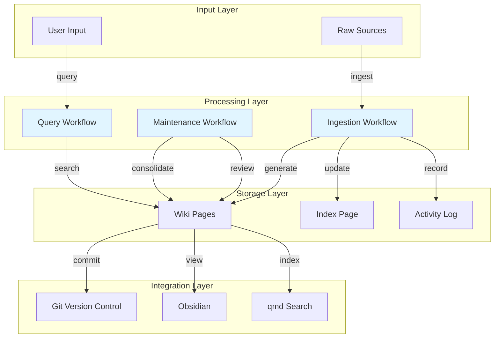

# Design Document: LLM Wiki Second Brain

## Overview

The LLM Wiki Second Brain transforms the Angular Aria research repository into an AI-powered knowledge management system based on Andrej Karpathy's LLM Wiki pattern. The system maintains a git-versioned, AI-curated knowledge base that compounds research findings over time while coexisting with the existing Angular monorepo structure.

### Core Concept

The system follows a clear separation between immutable raw sources and AI-generated wiki content:
- **raw/** directory stores original documents (PDFs, articles, code snippets, research notes)
- **wiki/** directory contains AI-generated, cross-referenced markdown pages
- **Schema configuration** defines structure, workflows, and AI instructions
- **Git version control** tracks all changes for history and collaboration

### Key Design Principles

1. **Immutability of Sources**: Raw documents are never modified after ingestion
2. **AI-Curated Knowledge**: Wiki pages are generated and maintained by AI agents
3. **Cross-Referencing**: All wiki pages link to related content using [[WikiLink]] syntax
4. **Git-Native**: All content stored as plain markdown in version control
5. **Tool Compatibility**: Works with Obsidian, qmd, and standard markdown tools
6. **Coexistence**: Does not interfere with existing Angular project structure

## Architecture

### Directory Structure

```
repository-root/
├── apps/                          # Existing Angular apps (unchanged)
├── libs/                          # Existing Angular libs (unchanged)
├── .kiro/                         # Existing Kiro config (unchanged)
├── raw/                           # NEW: Immutable source documents
│   ├── README.md                  # Source organization guide
│   ├── articles/                  # Web articles, blog posts
│   ├── papers/                    # Research papers, PDFs
│   ├── code-snippets/             # Code examples, gists
│   ├── notes/                     # Personal research notes
│   └── angular-aria/              # Angular Aria specific sources
├── wiki/                          # NEW: AI-generated wiki pages
│   ├── README.md                  # Wiki structure and workflow guide
│   ├── index.md                   # Top-level navigation page
│   ├── activity-log.md            # Chronological change log
│   ├── entities/                  # Pages about specific things
│   ├── concepts/                  # Pages about ideas and patterns
│   └── sources/                   # Summaries of raw sources
└── WIKI_SCHEMA.md                 # NEW: Schema config and AI instructions
```

### Component Architecture



## Components and Interfaces

### 1. Schema Configuration (WIKI_SCHEMA.md)

**Purpose**: Defines wiki structure, page types, and AI workflow instructions.

**Structure**:
```markdown
# Wiki Schema Configuration

## Directory Structure
[Defines raw/ and wiki/ organization]

## Page Types
### Entity Pages (entities/)
- Definition and purpose
- Properties and attributes
- Relationships to other entities
- Code examples
- Related concepts

### Concept Pages (concepts/)
- Explanation and context
- Applications and use cases
- Related concepts
- Examples and demonstrations

### Source Summaries (sources/)
- Source metadata (title, author, date, URL)
- Key points and insights
- Relevant quotes
- Related entities and concepts

## Workflows
### Ingestion Workflow
[AI instructions for processing raw sources]

### Query Workflow
[AI instructions for searching and retrieving]

### Maintenance Workflow
[AI instructions for reviewing and consolidating]

## Cross-Referencing Conventions
- Use [[WikiLink]] syntax
- Link entities when mentioned
- Link concepts when explained
- Bidirectional linking preferred

## Naming Conventions
- Entity pages: kebab-case-noun.md
- Concept pages: kebab-case-concept.md
- Source summaries: source-title-yyyy-mm-dd.md
```

**Interface**:
- Read by AI agents before executing workflows
- Updated manually when schema evolves
- Version controlled in git

### 2. Raw Source Storage

**Purpose**: Immutable storage for original documents.

**Supported Formats**:
- Markdown (.md)
- PDF (.pdf)
- Plain text (.txt)
- Code snippets (with language extension)

**Organization**:
- Subdirectories by category (articles/, papers/, code-snippets/, notes/)
- Flat structure within categories (avoid deep nesting)
- Original filenames preserved

**Interface**:
```typescript
interface RawSource {
  path: string;              // Relative path from raw/
  filename: string;          // Original filename
  format: 'md' | 'pdf' | 'txt' | 'code';
  category: string;          // Subdirectory name
  addedDate: Date;           // When added to repository
  content: string | Buffer;  // File content
}
```

### 3. Wiki Page Generator

**Purpose**: Converts raw sources into structured wiki pages with cross-references.

**Page Types**:

#### Entity Page
```markdown
---
title: Entity Name
type: entity
tags: [tag1, tag2]
sources: [source-ref-1, source-ref-2]
created: YYYY-MM-DD
updated: YYYY-MM-DD
---

# Entity Name

## Definition
[What is this entity?]

## Properties
[Key attributes and characteristics]

## Relationships
- Related to [[Other Entity]]
- Used in [[Concept Name]]
- Implements [[Pattern Name]]

## Examples
[Code examples or demonstrations]

## References
- [[Source Summary 1]]
- [[Source Summary 2]]
```

#### Concept Page
```markdown
---
title: Concept Name
type: concept
tags: [tag1, tag2]
sources: [source-ref-1]
created: YYYY-MM-DD
updated: YYYY-MM-DD
---

# Concept Name

## Explanation
[What is this concept?]

## Applications
[Where and how is it used?]

## Related Concepts
- [[Related Concept 1]]
- [[Related Concept 2]]

## Examples
[Demonstrations and use cases]

## References
- [[Source Summary]]
```

#### Source Summary
```markdown
---
title: Source Title
type: source
author: Author Name
date: YYYY-MM-DD
url: https://...
tags: [tag1, tag2]
created: YYYY-MM-DD
---

# Source Title

## Metadata
- **Author**: Author Name
- **Date**: YYYY-MM-DD
- **URL**: [link](https://...)
- **Type**: article | paper | code | note

## Key Points
- Point 1
- Point 2
- Point 3

## Insights
[Important takeaways and learnings]

## Relevant Entities
- [[Entity 1]]
- [[Entity 2]]

## Relevant Concepts
- [[Concept 1]]
- [[Concept 2]]

## Quotes
> Notable quote from source
```

**Interface**:
```typescript
interface WikiPage {
  path: string;              // Relative path from wiki/
  type: 'entity' | 'concept' | 'source';
  frontmatter: {
    title: string;
    type: string;
    tags: string[];
    sources?: string[];
    author?: string;
    date?: string;
    url?: string;
    created: string;
    updated: string;
  };
  content: string;           // Markdown body
  crossReferences: string[]; // Extracted [[WikiLink]] references
}
```

### 4. Index Page Manager

**Purpose**: Maintains top-level navigation and overview.

**Structure**:
```markdown
# Wiki Index

## Overview
[Brief description of wiki purpose and scope]

## Entities
- [[Entity 1]] - Brief description
- [[Entity 2]] - Brief description

## Concepts
- [[Concept 1]] - Brief description
- [[Concept 2]] - Brief description

## Recent Sources
- [[Source 1]] (YYYY-MM-DD)
- [[Source 2]] (YYYY-MM-DD)

## Navigation
- [Activity Log](activity-log.md)
- [All Entities](entities/)
- [All Concepts](concepts/)
- [All Sources](sources/)
```

**Update Triggers**:
- New wiki page created → Add to appropriate section
- Wiki page deleted → Remove from index
- Maintenance workflow → Reorganize and consolidate

**Interface**:
```typescript
interface IndexManager {
  addEntity(page: WikiPage): void;
  addConcept(page: WikiPage): void;
  addSource(page: WikiPage): void;
  removeEntry(pagePath: string): void;
  regenerate(): void;
}
```

### 5. Cross-Reference Engine

**Purpose**: Identifies and creates bidirectional links between related wiki pages.

**Link Detection**:
- Parse all wiki pages for [[WikiLink]] syntax
- Extract entity and concept names from content
- Match against existing wiki page titles
- Suggest new cross-references

**Link Creation**:
```typescript
interface CrossReferenceEngine {
  // Find existing pages that should be linked
  findRelatedPages(page: WikiPage): WikiPage[];
  
  // Extract all [[WikiLink]] references from content
  extractLinks(content: string): string[];
  
  // Validate that link targets exist
  validateLinks(page: WikiPage): { valid: string[], broken: string[] };
  
  // Suggest bidirectional links
  suggestBacklinks(page: WikiPage): { targetPage: string, context: string }[];
}
```

**Link Syntax**:
- `[[Page Title]]` - Link to page with title "Page Title"
- `[[Page Title|Display Text]]` - Link with custom display text
- `[[Page Title#Section]]` - Link to specific section

### 6. Activity Log Manager

**Purpose**: Records chronological history of wiki changes.

**Log Entry Format**:
```markdown
## YYYY-MM-DD HH:MM

### Created: [[Page Title]]
- Type: entity | concept | source
- Source: path/to/raw/source.md
- Tags: tag1, tag2

### Updated: [[Page Title]]
- Changes: Brief description of updates
- Reason: Why the update was made

### Ingested: raw/path/to/source.md
- Generated: [[Page 1]], [[Page 2]]
```

**Interface**:
```typescript
interface ActivityLog {
  recordCreation(page: WikiPage, source?: RawSource): void;
  recordUpdate(page: WikiPage, changes: string, reason: string): void;
  recordIngestion(source: RawSource, generatedPages: WikiPage[]): void;
  getRecentEntries(count: number): LogEntry[];
}
```

### 7. Query Engine

**Purpose**: Search and retrieve information from wiki.

**Search Capabilities**:
- Full-text search across all wiki content
- Tag-based filtering
- Entity/concept name search
- Source metadata search

**Interface**:
```typescript
interface QueryEngine {
  // Full-text search
  search(query: string): SearchResult[];
  
  // Tag-based search
  searchByTag(tag: string): WikiPage[];
  
  // Find by type
  findEntities(namePattern?: string): WikiPage[];
  findConcepts(namePattern?: string): WikiPage[];
  findSources(filters?: SourceFilters): WikiPage[];
  
  // Cross-reference search
  findBacklinks(pagePath: string): WikiPage[];
}

interface SearchResult {
  page: WikiPage;
  relevance: number;
  matchedContent: string[];
  relatedPages: WikiPage[];
}
```

### 8. Maintenance Engine

**Purpose**: Periodic review and consolidation of wiki content.

**Maintenance Tasks**:
1. **Duplicate Detection**: Find overlapping content across pages
2. **Contradiction Detection**: Identify conflicting information
3. **Link Validation**: Check all [[WikiLink]] references
4. **Consolidation Suggestions**: Recommend merging related pages
5. **Orphan Detection**: Find pages with no incoming links

**Interface**:
```typescript
interface MaintenanceEngine {
  // Detect duplicate or overlapping content
  findDuplicates(): { page1: WikiPage, page2: WikiPage, similarity: number }[];
  
  // Detect contradictions
  findContradictions(): { pages: WikiPage[], contradiction: string }[];
  
  // Validate all cross-references
  validateAllLinks(): { page: WikiPage, brokenLinks: string[] }[];
  
  // Suggest consolidation opportunities
  suggestConsolidation(): { pages: WikiPage[], reason: string }[];
  
  // Find orphaned pages
  findOrphans(): WikiPage[];
  
  // Generate maintenance report
  generateReport(): MaintenanceReport;
}
```

## Data Models

### WikiPage Model
```typescript
interface WikiPage {
  // File system
  path: string;              // Relative path from wiki/
  filename: string;          // File name
  
  // Metadata (from frontmatter)
  frontmatter: {
    title: string;
    type: 'entity' | 'concept' | 'source';
    tags: string[];
    sources?: string[];      // References to raw sources
    author?: string;         // For source summaries
    date?: string;           // For source summaries
    url?: string;            // For source summaries
    created: string;         // ISO date
    updated: string;         // ISO date
  };
  
  // Content
  content: string;           // Markdown body
  sections: Section[];       // Parsed sections
  
  // Cross-references
  outgoingLinks: string[];   // [[WikiLink]] references in this page
  incomingLinks: string[];   // Pages that link to this page
}

interface Section {
  heading: string;
  level: number;             // 1-6 for h1-h6
  content: string;
  subsections: Section[];
}
```

### RawSource Model
```typescript
interface RawSource {
  // File system
  path: string;              // Relative path from raw/
  filename: string;
  format: 'md' | 'pdf' | 'txt' | 'code';
  
  // Organization
  category: string;          // Subdirectory name
  
  // Metadata
  addedDate: Date;
  fileSize: number;
  
  // Content
  content: string | Buffer;
  
  // Processing status
  ingested: boolean;
  generatedPages: string[];  // Paths to generated wiki pages
}
```

### ActivityLogEntry Model
```typescript
interface ActivityLogEntry {
  timestamp: Date;
  type: 'creation' | 'update' | 'ingestion';
  
  // For creation and update
  pagePath?: string;
  pageTitle?: string;
  pageType?: 'entity' | 'concept' | 'source';
  
  // For update
  changes?: string;
  reason?: string;
  
  // For ingestion
  sourcePath?: string;
  generatedPages?: string[];
  
  // Common
  tags?: string[];
}
```

### MaintenanceReport Model
```typescript
interface MaintenanceReport {
  timestamp: Date;
  
  duplicates: {
    page1: string;
    page2: string;
    similarity: number;
    recommendation: string;
  }[];
  
  contradictions: {
    pages: string[];
    contradiction: string;
    severity: 'low' | 'medium' | 'high';
  }[];
  
  brokenLinks: {
    page: string;
    brokenLinks: string[];
  }[];
  
  consolidationOpportunities: {
    pages: string[];
    reason: string;
    suggestedAction: string;
  }[];
  
  orphans: {
    page: string;
    reason: string;
  }[];
  
  summary: {
    totalPages: number;
    totalLinks: number;
    healthScore: number;  // 0-100
  };
}
```

## Correctness Properties


*A property is a characteristic or behavior that should hold true across all valid executions of a system—essentially, a formal statement about what the system should do. Properties serve as the bridge between human-readable specifications and machine-verifiable correctness guarantees.*

### Property 1: Raw Source Immutability

*For any* file content added to the raw/ directory, the content SHALL remain unchanged after storage, preserving the original file exactly as provided.

**Validates: Requirements 3.5**

### Property 2: Ingestion Produces Wiki Pages

*For any* valid raw source document, the ingestion workflow SHALL generate at least one wiki page in the wiki/ directory.

**Validates: Requirements 4.1**

### Property 3: Wiki Page Structure Completeness

*For any* generated wiki page, it SHALL contain:
- A valid YAML frontmatter section with required metadata (title, type, tags, created, updated)
- Structured content sections appropriate to its page type:
  - Entity pages: definition, properties, relationships, examples
  - Concept pages: explanation, applications, related concepts, examples
  - Source summaries: key points, insights, source metadata

**Validates: Requirements 4.2, 4.5, 4.6, 4.7**

### Property 4: Index Completeness

*For any* set of wiki pages in the wiki/ directory, the index page SHALL list all entity pages, all concept pages, and recent source summaries with their descriptions.

**Validates: Requirements 5.2, 5.3, 5.4**

### Property 5: Index Synchronization

*For any* new wiki page created, the index page SHALL be updated to include a reference to the new page in the appropriate section.

**Validates: Requirements 5.6**

### Property 6: WikiLink Syntax Consistency

*For any* cross-reference link in a wiki page, it SHALL use the [[WikiLink]] syntax format.

**Validates: Requirements 6.1, 13.2**

### Property 7: Bidirectional Linking

*For any* two wiki pages where page A links to page B, page B SHOULD have a backlink reference to page A (bidirectional linking).

**Validates: Requirements 6.4**

### Property 8: Activity Log Completeness

*For any* wiki operation (raw source ingestion, wiki page creation, wiki page update), an activity log entry SHALL be created with timestamp and relevant metadata.

**Validates: Requirements 7.2, 7.3, 7.4**

### Property 9: Activity Log Ordering

*For any* set of activity log entries, they SHALL be ordered in reverse chronological order (newest first).

**Validates: Requirements 7.5**

### Property 10: Search Result Accuracy

*For any* search query by tag or entity/concept name, the search results SHALL return only wiki pages that match the query criteria.

**Validates: Requirements 8.2, 8.3**

### Property 11: Search Result Context

*For any* search result, it SHALL include cross-reference links to related pages for context.

**Validates: Requirements 8.5**

### Property 12: Maintenance Report Completeness

*For any* detected contradiction during maintenance, it SHALL appear in the maintenance report with the affected pages and contradiction description.

**Validates: Requirements 9.4**

### Property 13: Link Validation Completeness

*For any* wiki page containing [[WikiLink]] references, the maintenance workflow SHALL validate that all links point to existing pages or flag them as broken.

**Validates: Requirements 9.6**

### Property 14: Git Storage Consistency

*For any* wiki page or raw source file, it SHALL be stored as a plain file in the git repository (wiki pages as .md, raw sources in their original format).

**Validates: Requirements 10.1, 10.2**

### Property 15: Git Commit Synchronization

*For any* wiki page creation or update, a git commit SHALL be created to record the change.

**Validates: Requirements 10.4**

### Property 16: Markdown Compatibility

*For any* wiki page, it SHALL use standard markdown syntax compatible with Obsidian and other markdown tools.

**Validates: Requirements 13.1**

### Property 17: YAML Frontmatter Validity

*For any* wiki page, the frontmatter section SHALL be valid YAML format compatible with Obsidian.

**Validates: Requirements 13.3**

### Property 18: Tag Syntax Support

*For any* tag in a wiki page, it SHALL be recognized whether specified in frontmatter YAML format or inline #tag syntax.

**Validates: Requirements 13.5**

### Property 19: Naming Convention Consistency

*For any* wiki page filename, it SHALL follow the naming conventions defined in the schema:
- Entity pages: kebab-case-noun.md
- Concept pages: kebab-case-concept.md
- Source summaries: source-title-yyyy-mm-dd.md

**Validates: Requirements 14.3**

## Error Handling

### File System Errors

**Directory Creation Failures**:
- If raw/ or wiki/ directories cannot be created during initialization, abort with clear error message
- Check for write permissions before attempting directory creation
- Provide fallback suggestions (check permissions, disk space)

**File Read/Write Failures**:
- If raw source cannot be read, log error and skip ingestion for that file
- If wiki page cannot be written, log error and preserve partial state
- Implement atomic writes where possible (write to temp file, then rename)

**Git Operation Failures**:
- If git commit fails, log error but preserve wiki changes
- Provide manual commit instructions in error message
- Continue operation even if git integration fails (degrade gracefully)

### Content Processing Errors

**Invalid Frontmatter**:
- If wiki page frontmatter is malformed, attempt to repair or regenerate
- Log warning with specific YAML parsing error
- Provide default values for missing required fields

**Broken Cross-References**:
- If [[WikiLink]] points to non-existent page, flag in maintenance report
- Do not fail page creation due to broken links
- Suggest creating missing pages or removing invalid links

**Duplicate Page Detection**:
- If wiki page with same name already exists, append timestamp or counter
- Log warning about duplicate
- Provide option to merge or keep separate

### Search and Query Errors

**Empty Search Results**:
- Return empty result set with helpful message
- Suggest alternative search terms
- Provide link to index page for browsing

**Invalid Search Query**:
- Sanitize search input to prevent injection
- Return error message for malformed queries
- Provide query syntax help

### Maintenance Workflow Errors

**Contradiction Detection Failures**:
- If AI-based contradiction detection fails, log error and continue
- Provide manual review option
- Skip contradiction detection if unavailable

**Link Validation Failures**:
- If link validation encounters errors, log and continue
- Report partial results
- Provide manual validation option

### Integration Errors

**Obsidian Compatibility Issues**:
- If markdown syntax is incompatible, log warning
- Provide conversion suggestions
- Maintain backward compatibility with standard markdown

**External Search Tool Issues**:
- If qmd or other search tools cannot index wiki/, provide troubleshooting steps
- Ensure wiki/ structure remains accessible
- Document known compatibility issues

## Testing Strategy

### Unit Testing

Unit tests will verify specific examples, edge cases, and error conditions:

**Initialization Tests**:
- Verify directory structure is created correctly
- Verify schema config file contains required sections
- Verify example pages are created with correct structure
- Verify existing Angular project files are not modified

**File Format Tests**:
- Verify markdown, PDF, text, and code files can be added to raw/
- Verify wiki pages are generated with correct frontmatter
- Verify YAML frontmatter is valid
- Verify markdown syntax is standard

**Search Tests**:
- Verify search by tag returns correct pages
- Verify search by name returns correct pages
- Verify search ranking works with specific queries
- Verify empty search results are handled

**Maintenance Tests**:
- Verify duplicate detection with specific examples
- Verify link validation detects broken links
- Verify maintenance report is generated

**Git Integration Tests**:
- Verify commits are created for wiki changes
- Verify commit messages are meaningful
- Verify git history is accessible

**Error Handling Tests**:
- Verify graceful handling of file system errors
- Verify graceful handling of invalid frontmatter
- Verify graceful handling of broken links

### Property-Based Testing

Property-based tests will verify universal properties across all inputs using a PBT library (fast-check for TypeScript/JavaScript):

**Configuration**: Each property test will run a minimum of 100 iterations to ensure comprehensive coverage through randomization.

**Test Organization**: Each property test will include a comment tag referencing the design document property:
```typescript
// Feature: llm-wiki-second-brain, Property 1: Raw Source Immutability
```

**Properties to Test**:

1. **Raw Source Immutability** (Property 1)
   - Generate random file content
   - Add to raw/ directory
   - Verify content is identical after storage

2. **Ingestion Produces Wiki Pages** (Property 2)
   - Generate random raw source documents
   - Run ingestion workflow
   - Verify at least one wiki page is created

3. **Wiki Page Structure Completeness** (Property 3)
   - Generate random wiki pages of each type
   - Verify frontmatter contains required fields
   - Verify content sections match page type

4. **Index Completeness** (Property 4)
   - Generate random sets of wiki pages
   - Verify index lists all entities, concepts, and recent sources

5. **Index Synchronization** (Property 5)
   - Generate random wiki pages
   - Create them
   - Verify index is updated

6. **WikiLink Syntax Consistency** (Property 6)
   - Generate random wiki pages with cross-references
   - Verify all links use [[WikiLink]] syntax

7. **Bidirectional Linking** (Property 7)
   - Generate random pairs of linked pages
   - Verify backlinks exist

8. **Activity Log Completeness** (Property 8)
   - Generate random wiki operations
   - Verify log entries are created

9. **Activity Log Ordering** (Property 9)
   - Generate random log entries with timestamps
   - Verify reverse chronological ordering

10. **Search Result Accuracy** (Property 10)
    - Generate random wiki pages with tags and names
    - Search by tag/name
    - Verify only matching pages are returned

11. **Search Result Context** (Property 11)
    - Generate random search results
    - Verify cross-references are included

12. **Maintenance Report Completeness** (Property 12)
    - Generate random contradictions
    - Run maintenance
    - Verify contradictions appear in report

13. **Link Validation Completeness** (Property 13)
    - Generate random wiki pages with valid and broken links
    - Run link validation
    - Verify broken links are detected

14. **Git Storage Consistency** (Property 14)
    - Generate random wiki pages and raw sources
    - Store them
    - Verify they exist as files in git repository

15. **Git Commit Synchronization** (Property 15)
    - Generate random wiki page changes
    - Verify commits are created

16. **Markdown Compatibility** (Property 16)
    - Generate random wiki pages
    - Verify markdown syntax is standard

17. **YAML Frontmatter Validity** (Property 17)
    - Generate random wiki pages
    - Parse frontmatter as YAML
    - Verify it is valid

18. **Tag Syntax Support** (Property 18)
    - Generate random tags in both formats
    - Verify both are recognized

19. **Naming Convention Consistency** (Property 19)
    - Generate random wiki page filenames
    - Verify they follow naming conventions

### Integration Testing

Integration tests will verify AI workflows and external tool compatibility:

**AI Workflow Tests**:
- Test ingestion workflow with real AI agent
- Test query workflow with real AI agent
- Test maintenance workflow with real AI agent
- Verify cross-references are generated appropriately
- Verify contradictions are detected
- Verify consolidation suggestions are made

**External Tool Tests**:
- Test Obsidian compatibility by opening wiki/ in Obsidian
- Test qmd search tool integration
- Test git operations (log, diff, history)

**End-to-End Tests**:
- Test complete workflow: add raw source → ingest → query → maintain
- Test Angular Aria research integration
- Test coexistence with Angular project

### Smoke Testing

Smoke tests will verify one-time setup and configuration:

**Initialization Tests**:
- Verify raw/ directory is created
- Verify wiki/ directory is created
- Verify WIKI_SCHEMA.md is created
- Verify wiki/index.md is created
- Verify wiki/activity-log.md is created
- Verify example pages are created
- Verify README files are created
- Verify existing Angular project is unchanged

**Configuration Tests**:
- Verify schema config contains all required sections
- Verify directory structure is correct
- Verify naming conventions are documented

### Test Coverage Goals

- **Unit Tests**: 80%+ code coverage for utility functions and data models
- **Property Tests**: 100% coverage of all 19 correctness properties
- **Integration Tests**: Coverage of all AI workflows and external tool integrations
- **Smoke Tests**: Coverage of all initialization and setup requirements

### Testing Tools

- **Unit Testing**: Jest or Vitest (already in Angular project)
- **Property-Based Testing**: fast-check (TypeScript/JavaScript PBT library)
- **Integration Testing**: Custom test harness for AI workflows
- **Git Testing**: Simple git commands in test scripts

## Implementation Phases

### Phase 1: Bootstrap and Directory Structure
- Create raw/ and wiki/ directories
- Create WIKI_SCHEMA.md with initial configuration
- Create wiki/index.md and wiki/activity-log.md
- Create README files in raw/ and wiki/
- Create example wiki pages (entity, concept, source summary)
- Verify coexistence with Angular project

### Phase 2: Core Data Models and Utilities
- Implement WikiPage, RawSource, ActivityLogEntry models
- Implement file system utilities (read, write, list)
- Implement frontmatter parser and generator
- Implement markdown utilities
- Implement naming convention validators

### Phase 3: Wiki Page Generation
- Implement wiki page generator for each type
- Implement frontmatter generation
- Implement content section templates
- Implement [[WikiLink]] syntax support
- Implement cross-reference detection

### Phase 4: Index and Activity Log Management
- Implement index page manager
- Implement activity log manager
- Implement automatic index updates
- Implement log entry creation

### Phase 5: Ingestion Workflow
- Implement raw source ingestion
- Implement wiki page generation from sources
- Implement cross-reference creation
- Implement index and log updates
- Implement git commit creation

### Phase 6: Query and Search
- Implement full-text search
- Implement tag-based search
- Implement name-based search
- Implement search result ranking
- Implement cross-reference inclusion in results

### Phase 7: Maintenance Workflow
- Implement link validation
- Implement duplicate detection
- Implement maintenance report generation
- Implement consolidation suggestions
- Implement orphan detection

### Phase 8: Git Integration
- Implement automatic git commits
- Implement commit message generation
- Implement git history support
- Verify git operations work correctly

### Phase 9: External Tool Compatibility
- Verify Obsidian compatibility
- Verify qmd search tool compatibility
- Document any compatibility issues
- Provide troubleshooting guides

### Phase 10: Testing and Documentation
- Write unit tests for all components
- Write property-based tests for all 19 properties
- Write integration tests for AI workflows
- Write smoke tests for initialization
- Document usage and workflows
- Create user guide

## Dependencies

### External Libraries

**Markdown Processing**:
- `remark` or `marked` - Markdown parsing and generation
- `gray-matter` - Frontmatter parsing and generation
- `js-yaml` - YAML parsing and generation

**File System**:
- Node.js `fs` module - File operations
- `glob` or `fast-glob` - File pattern matching

**Search**:
- `fuse.js` or `lunr` - Full-text search
- Custom tag and name search implementation

**Git Integration**:
- `simple-git` - Git operations from Node.js
- Or direct git CLI commands via child_process

**Property-Based Testing**:
- `fast-check` - Property-based testing library for TypeScript

**Testing**:
- `jest` or `vitest` - Unit testing (already in project)
- `@testing-library` - Testing utilities (already in project)

### Internal Dependencies

**Angular Project**:
- Must not modify existing Angular project structure
- Can read from Angular project for code ingestion
- Separate from Angular build and test processes

**Kiro Configuration**:
- Must not modify existing .kiro/ configuration
- Can add new .kiro/skills/ for wiki workflows
- Can add new .kiro/steering/ for wiki guidance

### AI Agent Dependencies

**Ingestion Workflow**:
- Requires AI agent capable of reading raw sources
- Requires AI agent capable of generating structured wiki pages
- Requires AI agent capable of identifying cross-references

**Query Workflow**:
- Requires AI agent capable of understanding search queries
- Requires AI agent capable of ranking results by relevance

**Maintenance Workflow**:
- Requires AI agent capable of detecting duplicates
- Requires AI agent capable of detecting contradictions
- Requires AI agent capable of suggesting consolidations

## Security Considerations

### File System Access

**Path Traversal Prevention**:
- Validate all file paths to prevent directory traversal attacks
- Restrict file operations to raw/ and wiki/ directories
- Sanitize filenames to prevent malicious names

**File Size Limits**:
- Implement maximum file size for raw sources (e.g., 10MB)
- Prevent denial of service through large file uploads
- Log warnings for oversized files

### Content Injection

**Markdown Injection**:
- Sanitize user-provided content in wiki pages
- Prevent XSS through malicious markdown
- Validate frontmatter YAML to prevent code injection

**Cross-Reference Injection**:
- Validate [[WikiLink]] syntax to prevent malicious links
- Prevent linking to files outside wiki/ directory
- Sanitize link targets

### Git Security

**Commit Message Injection**:
- Sanitize commit messages to prevent command injection
- Validate commit message format
- Use git library instead of shell commands where possible

**Repository Access**:
- Ensure git operations only affect wiki/ and raw/ directories
- Prevent accidental commits of sensitive files
- Validate git repository state before operations

### AI Workflow Security

**Prompt Injection**:
- Sanitize raw source content before passing to AI
- Validate AI-generated content before storing
- Implement content filtering for inappropriate content

**Data Privacy**:
- Do not send sensitive Angular project code to external AI services
- Keep wiki content local unless explicitly shared
- Document data handling practices

## Performance Considerations

### File System Performance

**Directory Scanning**:
- Use efficient glob patterns for file discovery
- Cache directory listings when appropriate
- Implement incremental scanning for large wikis

**File Reading**:
- Stream large files instead of loading into memory
- Implement lazy loading for wiki pages
- Cache frequently accessed pages

### Search Performance

**Indexing**:
- Build search index incrementally as pages are added
- Persist search index to disk for fast startup
- Rebuild index only when necessary

**Query Performance**:
- Implement query result caching
- Limit result set size
- Use efficient search algorithms (inverted index)

### Git Performance

**Commit Frequency**:
- Batch multiple wiki changes into single commit when appropriate
- Avoid committing on every minor change
- Implement commit debouncing

**Repository Size**:
- Monitor repository size growth
- Implement git LFS for large binary files (PDFs)
- Provide cleanup utilities for old content

### Memory Usage

**Large Wikis**:
- Implement pagination for index page
- Stream activity log instead of loading entirely
- Use generators for large result sets

**Concurrent Operations**:
- Limit concurrent file operations
- Implement operation queuing
- Monitor memory usage during maintenance

## Monitoring and Observability

### Logging

**Operation Logging**:
- Log all wiki operations (create, update, delete)
- Log all ingestion operations
- Log all maintenance operations
- Include timestamps and operation details

**Error Logging**:
- Log all errors with stack traces
- Log warnings for non-fatal issues
- Provide context for debugging

### Metrics

**Wiki Growth**:
- Track number of wiki pages over time
- Track number of raw sources over time
- Track wiki size (bytes) over time

**Operation Metrics**:
- Track ingestion time per source
- Track search query time
- Track maintenance workflow time

**Quality Metrics**:
- Track number of broken links
- Track number of orphaned pages
- Track number of detected contradictions

### Health Checks

**System Health**:
- Verify directory structure is intact
- Verify index page is up to date
- Verify activity log is accessible
- Verify git repository is healthy

**Content Health**:
- Run link validation periodically
- Check for duplicate content
- Verify frontmatter validity

## Future Enhancements

### Advanced Search

**Semantic Search**:
- Implement vector-based semantic search
- Use embeddings for similarity matching
- Provide "related pages" suggestions

**Faceted Search**:
- Filter by multiple tags simultaneously
- Filter by date range
- Filter by page type

### Collaboration Features

**Multi-User Support**:
- Handle concurrent wiki edits
- Implement conflict resolution
- Provide user attribution in activity log

**Review Workflow**:
- Implement wiki page review process
- Add approval workflow for AI-generated content
- Track review status in frontmatter

### Advanced Maintenance

**Automated Consolidation**:
- Automatically merge duplicate pages
- Automatically resolve contradictions
- Automatically update stale content

**Content Quality Scoring**:
- Score pages by completeness
- Score pages by cross-reference density
- Identify low-quality pages for improvement

### Integration Enhancements

**IDE Integration**:
- VS Code extension for wiki navigation
- IntelliSense for [[WikiLink]] completion
- Quick preview of wiki pages

**CI/CD Integration**:
- Automated wiki validation in CI pipeline
- Automated maintenance reports
- Automated link checking

### Analytics

**Usage Analytics**:
- Track most viewed pages
- Track most searched terms
- Track user navigation patterns

**Content Analytics**:
- Identify knowledge gaps
- Identify highly connected pages
- Visualize wiki graph structure

