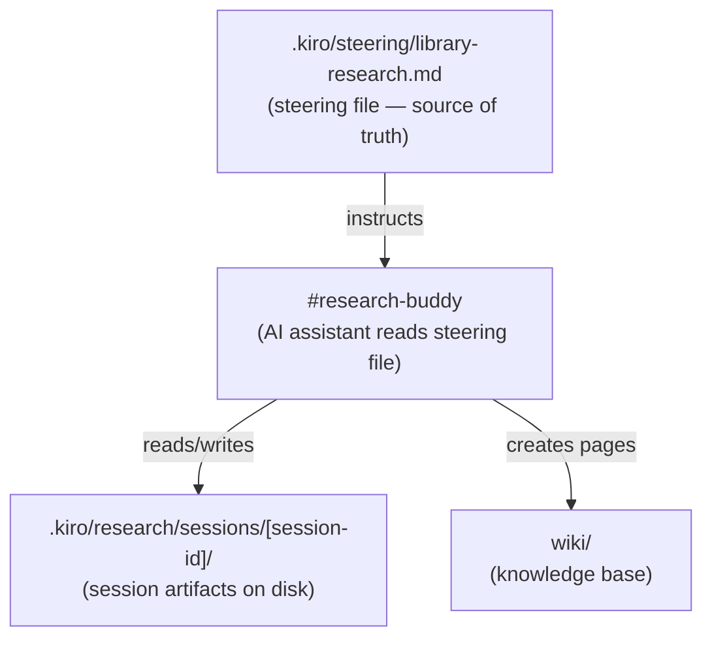
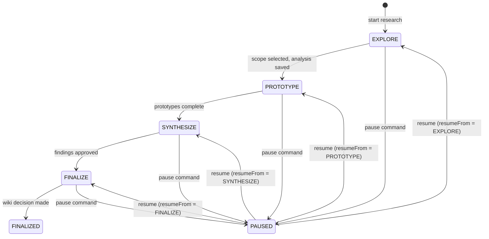
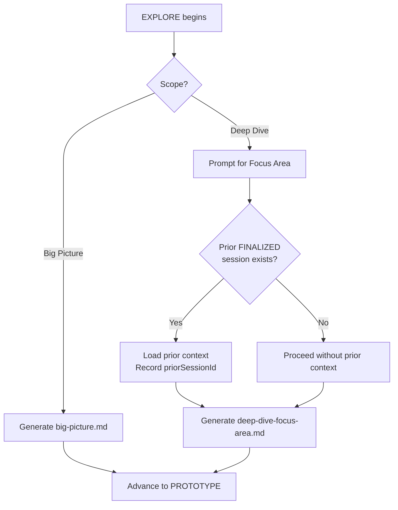

# Design Document: Single Library Research Workflow

## Overview

This feature adds a structured 4-step guided workflow for single-library research to the existing `library-research.md` steering file. The current steering file only describes a comparison-oriented workflow (START → RESEARCH → PROTOTYPE → COMPARE → FINALIZE). When a developer wants to deeply understand one library without comparing it to alternatives, there is no guided path.

The new workflow — EXPLORE → PROTOTYPE → SYNTHESIZE → FINALIZE — is implemented entirely as a steering file update. No application code changes are required. The steering file is a markdown document that the AI assistant (`#research-buddy`) reads to understand how to guide the user. Adding the workflow there is sufficient to change the assistant's behavior.

The workflow supports two scopes chosen at session start:

- **Big Picture** — a full library overview: entry points, exported symbols, public API surface, peer dependencies
- **Deep Dive** — a focused analysis of a specific library area (e.g., "grid pattern", "form validation directives")

Scope selection happens once at the EXPLORE step and governs every subsequent step: which analysis is generated, what prototypes are suggested, how the findings summary is structured, and which wiki pages are created at finalization.

When a Deep Dive session starts, the workflow automatically searches for any prior FINALIZED session for the same library and loads it as context. This allows incremental knowledge building — a developer can do a Big Picture session first, then multiple targeted Deep Dive sessions that each reference what came before.

## Architecture

The implementation is a steering file update only. There is no runtime code, no build step, and no deployment. The architecture is therefore the relationship between the steering file, the AI assistant, and the session artifacts on disk.



### Workflow State Machine



### Scope Decision Tree



## Components and Interfaces

Because this is a steering file feature, "components" are the logical sections of the steering file and the commands the AI assistant responds to.

### Steering File Sections

The updated `library-research.md` will contain two top-level workflow sections:

1. **Comparison Workflow** — the existing START → RESEARCH → PROTOTYPE → COMPARE → FINALIZE flow (unchanged)
2. **Single Library Workflow** — the new EXPLORE → PROTOTYPE → SYNTHESIZE → FINALIZE flow (added by this feature)

Each section defines:
- State machine (valid states and transitions)
- Step-by-step instructions for the AI assistant
- Artifact specifications (filenames, paths, required content)
- Commands the user can issue

### Commands

The steering file defines these commands for the single library workflow:

| Command | Trigger | Effect |
|---|---|---|
| `start research: [topic]` | User | Begins EXPLORE step, prompts for library name and scope |
| `explore [library]` | User | Shorthand to start Big Picture EXPLORE for a library |
| `deep dive [library] into [area]` | User | Shorthand to start Deep Dive EXPLORE for a library and focus area |
| `prototype [pattern]` | User | Creates a prototype in the PROTOTYPE step |
| `synthesize` | User | Triggers findings consolidation in SYNTHESIZE step |
| `finalize research` | User | Triggers wiki decision in FINALIZE step |
| `pause research` | User | Pauses session at current step |
| `continue research: [session-id]` | User | Resumes a paused session |

### Step Interfaces

Each step has defined inputs, outputs, and state transitions:

**EXPLORE**
- Input: library name, optional version/URL, scope choice, focus area (Deep Dive only)
- Output: `big-picture.md` or `deep-dive-[focus-area].md`, updated `session.json`
- Transition: → PROTOTYPE

**PROTOTYPE**
- Input: user-described use case (Deep Dive: also suggestions from analysis)
- Output: one or more files under `prototypes/`, updated `session.json`
- Transition: → SYNTHESIZE

**SYNTHESIZE**
- Input: EXPLORE analysis + all prototypes
- Output: `findings-summary.md`, updated `session.json`
- Transition: → FINALIZE

**FINALIZE**
- Input: user wiki decision (yes/no)
- Output: wiki pages (if accepted), updated `session.json` with `wikiPages`, `finalizedAt`, `state: "FINALIZED"`
- Transition: → FINALIZED

## Data Models

### session.json Schema

The `session.json` file is the single source of truth for session state. The single library workflow adds three new fields (`scope`, `focusArea`, `priorSessionId`) to the existing schema.

```jsonc
{
  // Required at creation (EXPLORE step)
  "id": "string",                    // kebab-case session identifier
  "topic": "string",                 // human-readable description
  "state": "EXPLORE | PROTOTYPE | SYNTHESIZE | FINALIZE | PAUSED | FINALIZED",
  "scope": "big-picture | deep-dive",
  "createdAt": "YYYY-MM-DD",
  "libraries": ["string"],           // exactly one entry for single library sessions
  "version": "string",               // installed library version
  "sources": ["string"],             // documentation URLs and node_modules paths

  // Conditional: only present for Deep Dive sessions
  "focusArea": "string",             // e.g. "grid pattern", "form validation"

  // Conditional: only present when a prior FINALIZED session was found
  "priorSessionId": "string",        // id of the prior session used as context

  // Added when session is paused
  "pausedAt": "YYYY-MM-DD",
  "resumeFrom": "EXPLORE | PROTOTYPE | SYNTHESIZE | FINALIZE",

  // Added at finalization
  "finalizedAt": "YYYY-MM-DD",
  "wikiPages": ["string"]            // paths of created wiki pages, [] if declined
}
```

**State field allowed values:** `"EXPLORE"`, `"PROTOTYPE"`, `"SYNTHESIZE"`, `"FINALIZE"`, `"PAUSED"`, `"FINALIZED"`

**Scope field allowed values:** `"big-picture"`, `"deep-dive"`

### Session Directory Structure

```
.kiro/research/sessions/[session-id]/
├── session.json                        # always present
├── big-picture.md                      # Big Picture scope only
├── deep-dive-[focus-area].md           # Deep Dive scope only (kebab-case focus area)
├── findings-summary.md                 # created at SYNTHESIZE step
└── prototypes/
    ├── [descriptive-name].ts           # one file per prototype
    └── ...
```

**Naming rules:**
- `[session-id]` — kebab-case, e.g. `rxjs-big-picture`, `rxjs-operators-deep-dive`
- `deep-dive-[focus-area].md` — focus area is kebab-cased, e.g. `deep-dive-grid-pattern.md`, `deep-dive-form-validation.md`
- Prototype filenames — descriptive, kebab-case, e.g. `basic-observable.ts`, `switchmap-cancellation.ts`

### Wiki Pages Produced at FINALIZE

When the user accepts wiki publication, the assistant creates pages following the existing `WIKI_SCHEMA.md` conventions:

| Page | Path | Type | Condition |
|---|---|---|---|
| Library entity | `wiki/entities/[library-name].md` | entity | Always |
| Pattern concept(s) | `wiki/concepts/[pattern-name].md` | concept | One per significant pattern |
| Research source | `wiki/sources/[library]-[scope]-[date].md` | source | Always |

For Deep Dive sessions, the entity page is scoped to the focus area (e.g., `wiki/entities/rxjs-operators.md`) rather than the full library, unless a library entity page already exists.

All created page paths are recorded in `session.json` under `wikiPages`.

## Correctness Properties

*A property is a characteristic or behavior that should hold true across all valid executions of a system — essentially, a formal statement about what the system should do. Properties serve as the bridge between human-readable specifications and machine-verifiable correctness guarantees.*

### Property 1: Session state only advances forward through valid transitions

*For any* single library research session, the `state` field in `session.json` SHALL only ever contain one of the six valid values (`EXPLORE`, `PROTOTYPE`, `SYNTHESIZE`, `FINALIZE`, `PAUSED`, `FINALIZED`), and non-paused transitions SHALL only move forward along the defined sequence (EXPLORE → PROTOTYPE → SYNTHESIZE → FINALIZE → FINALIZED).

**Validates: Requirements 1.1, 1.2, 6.5**

### Property 2: Scope field is always one of the two valid values

*For any* session.json written by the single library workflow, the `scope` field SHALL be exactly `"big-picture"` or `"deep-dive"` — no other value is valid.

**Validates: Requirements 6.6**

### Property 3: Deep Dive sessions always record focusArea

*For any* session created with scope `"deep-dive"`, the `session.json` SHALL contain a non-empty `focusArea` field. Sessions with scope `"big-picture"` SHALL NOT contain a `focusArea` field.

**Validates: Requirements 2.3, 6.2**

### Property 4: Prior session linkage is consistent

*For any* Deep Dive session where a prior FINALIZED session exists for the same library, the `priorSessionId` in the new session's `session.json` SHALL match the `id` of that prior session. If no prior FINALIZED session exists, `priorSessionId` SHALL be absent.

**Validates: Requirements 2.9, 2.10, 2.11, 6.3**

### Property 5: Artifact filename matches scope

*For any* completed EXPLORE step, the analysis artifact saved to the session directory SHALL be named `big-picture.md` when scope is `"big-picture"`, and `deep-dive-[kebab-cased-focus-area].md` when scope is `"deep-dive"`. No other filename is valid for the primary analysis artifact.

**Validates: Requirements 2.8, 2.13, 7.2**

### Property 6: wikiPages is always recorded at finalization

*For any* session that reaches FINALIZED state, `session.json` SHALL contain a `wikiPages` array. When the user declines wiki publication, `wikiPages` SHALL be an empty array `[]`. When the user accepts, `wikiPages` SHALL contain the paths of all created wiki pages (at minimum one entity page, one source page).

**Validates: Requirements 5.3, 5.8, 5.9**

### Property 7: Pause/resume round-trip preserves step

*For any* session paused at step S, resuming that session SHALL restore `state` to S (the value stored in `resumeFrom`), and `pausedAt` and `resumeFrom` SHALL be removed from `session.json` after resumption.

**Validates: Requirements 8.1, 8.2, 8.3, 8.9**

### Property 8: libraries array contains exactly one entry

*For any* session.json created by the single library workflow, the `libraries` array SHALL contain exactly one element.

**Validates: Requirements 6.7**

## Error Handling

### Library Installation Failures (EXPLORE step)

- If `npm install` fails, the assistant reports the error with the npm output and prompts the user to correct the library name before retrying. The session is not advanced.
- If the library is already installed, the assistant reports the installed version and asks whether to reinstall or continue. This prevents silent version mismatches.

### Missing Prior Session Context (Deep Dive)

- If no prior FINALIZED session exists for the library, the assistant notes this explicitly in the session and proceeds without prior context. This is not an error — it is a normal first-time Deep Dive.
- If a `priorSessionId` is recorded but the referenced session directory is missing or corrupt, the assistant warns the user and proceeds without that context rather than blocking the workflow.

### Missing Library at Resume

- When resuming a paused session, the assistant checks whether the library still exists in `node_modules`. If it is missing, the assistant offers to reinstall before continuing. The session state is not changed until the user confirms.

### Invalid State Transitions

- If the user attempts to skip a step, the assistant confirms the intent explicitly, records the skipped state in `session.json` (e.g., `"skippedSteps": ["PROTOTYPE"]`), and advances. This prevents accidental skips while still allowing intentional ones.

### Wiki Page Creation Failures (FINALIZE step)

- If a wiki page cannot be written (e.g., path conflict, permission issue), the assistant reports which pages succeeded and which failed, records only the successfully created pages in `wikiPages`, and offers to retry the failed ones. The session is still marked `FINALIZED`.

## Testing Strategy

This feature is a steering file update — there is no application code to unit test. The correctness properties above describe behavioral invariants that the AI assistant must uphold when following the steering file instructions.

### Verification Approach

**Manual acceptance testing** is the primary verification method. Each correctness property maps to a test scenario:

| Property | Test Scenario |
|---|---|
| P1: State transitions | Walk through a full session; verify `session.json` state at each step |
| P2: Scope values | Start sessions with both scopes; inspect `session.json` |
| P3: focusArea presence | Start Big Picture and Deep Dive sessions; verify field presence/absence |
| P4: Prior session linkage | Run a Big Picture session to FINALIZED, then start a Deep Dive for the same library; verify `priorSessionId` |
| P5: Artifact filename | Complete EXPLORE for both scopes; verify filenames on disk |
| P6: wikiPages at finalization | Finalize with and without wiki acceptance; verify `wikiPages` content |
| P7: Pause/resume round-trip | Pause at each step; resume; verify state restored correctly |
| P8: Single library | Inspect `libraries` array after session creation |

### Steering File Review Checklist

Before the steering file update is considered complete, verify:

- [ ] Single Library Workflow section is clearly separated from the Comparison Workflow section
- [ ] All four steps (EXPLORE, PROTOTYPE, SYNTHESIZE, FINALIZE) are documented with their inputs, outputs, and transitions
- [ ] Both scope modes (Big Picture, Deep Dive) are described for each step that behaves differently
- [ ] All commands (`explore`, `deep dive ... into`, `prototype`, `synthesize`, `finalize research`) are listed
- [ ] Session directory structure is shown with all expected files for both scopes
- [ ] Wiki publication decision and page types are described in the FINALIZE section
- [ ] Pause/resume behavior is documented
- [ ] `session.json` schema (including new fields `scope`, `focusArea`, `priorSessionId`) is specified
