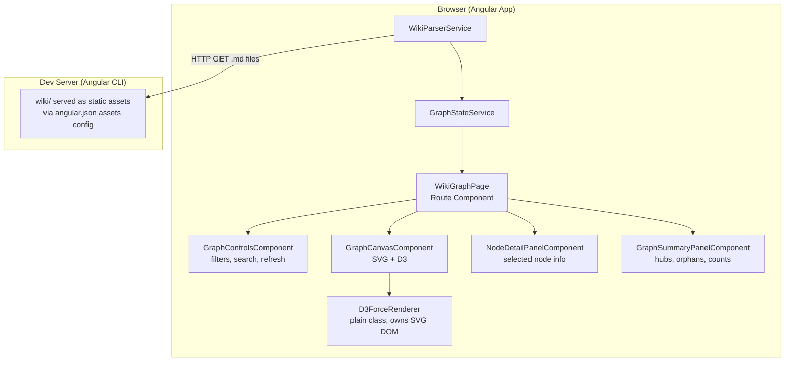

# Design Document: Wiki Connections Visualizer

## Overview

The Wiki Connections Visualizer is a new route (`/wiki-graph`) in the `deep-dive-angular-aria` Angular application. It reads all wiki markdown files, parses `[[wikilink]]` connections, and renders an interactive force-directed knowledge graph — similar to Obsidian's graph view.

The core challenge is that Angular runs in the browser but the wiki lives on the local filesystem. The solution is to configure Angular's dev server to serve the `wiki/` directory as static assets, then fetch and parse the files via HTTP. This is a local-dev-only tool, so this approach is appropriate and avoids any backend complexity.

D3.js handles the force simulation and SVG rendering. Angular manages state, component lifecycle, and user interactions. The two are integrated by letting D3 own the SVG DOM directly (via `ElementRef`) while Angular owns the data and UI controls.

### Key Design Decisions

- **HTTP asset serving over filesystem API**: The browser has no filesystem access. Serving `wiki/` as static assets via Angular's dev server asset configuration is the simplest approach — no Express server, no Electron, no Node.js backend needed.
- **D3 owns the SVG, Angular owns the data**: Mixing Angular's change detection with D3's direct DOM manipulation is a known friction point. The clean boundary is: Angular services produce `GraphData`, Angular components pass it to a D3 renderer class, and D3 writes directly to the SVG element. Angular never touches SVG nodes.
- **Port parsing logic, don't import from wiki-mcp-server**: The MCP server uses Node.js `fs` APIs. The Angular service reimplements the same pure parsing logic (wikilink extraction, frontmatter parsing) using browser-compatible code. `gray-matter` is already a workspace dependency and works in the browser.
- **Signal-based state**: Angular 21 signals are used for reactive state (selected node, filters, search query) to avoid unnecessary `zone.js` overhead in the D3 render loop.

---

## Architecture



### Data Flow

```
1. App initializes → WikiParserService.loadGraph()
2. WikiParserService fetches wiki/index listing (manifest JSON)
3. For each .md file path: HTTP GET → raw markdown string
4. Parse frontmatter (gray-matter) → extract title, type, tags
5. Extract [[wikilinks]] from content body → outgoing link targets
6. Build GraphData: nodes map + edges array + ghost nodes for broken links
7. GraphStateService receives GraphData → computes derived stats (hubs, orphans)
8. GraphCanvasComponent receives GraphData → passes to D3ForceRenderer
9. D3ForceRenderer initializes force simulation → renders SVG nodes + edges
10. User interactions (click, drag, zoom) → D3 handles directly
11. Node selection → D3 calls Angular callback → GraphStateService.selectNode()
12. GraphStateService.selectedNode signal → NodeDetailPanelComponent updates
```

### Wiki File Discovery

The Angular dev server cannot enumerate a directory. The solution is a **pre-generated manifest file**: a small JSON file (`wiki/manifest.json`) listing all `.md` file paths. This manifest is generated as part of the dev workflow (a simple Node.js script) and committed alongside the wiki. The `WikiParserService` fetches this manifest first, then fetches each file in parallel.

Alternatively, for a zero-config approach: the Angular build's `assets` config copies the entire `wiki/` directory into the build output, and a manifest is generated at build time via a custom Nx executor or a `postbuild` script.

---

## Components and Interfaces

### Component Tree

```
WikiGraphPageComponent          (route: /wiki-graph)
├── GraphControlsComponent      (filter toggles, search input, refresh button)
├── GraphCanvasComponent        (SVG element, hosts D3ForceRenderer)
├── NodeDetailPanelComponent    (shown when a node is selected)
└── GraphSummaryPanelComponent  (hub nodes list, orphan count, totals)
```

### WikiParserService

Responsible for fetching and parsing wiki files. Stateless — returns `GraphData` on each call.

```typescript
@Injectable({ providedIn: 'root' })
class WikiParserService {
  loadGraph(): Observable<GraphData>
  // Fetches manifest, then all .md files in parallel.
  // Returns complete GraphData including ghost nodes.
}
```

### GraphStateService

Holds all reactive state for the visualizer. Components read signals; user actions call methods.

```typescript
@Injectable({ providedIn: 'root' })
class GraphStateService {
  // Signals (read-only to consumers)
  readonly graphData: Signal<GraphData | null>
  readonly selectedNode: Signal<GraphNode | null>
  readonly activeTypeFilters: Signal<Set<NodeType>>
  readonly searchQuery: Signal<string>
  readonly activeTagFilter: Signal<string | null>
  readonly isLoading: Signal<boolean>
  readonly error: Signal<string | null>

  // Derived signals
  readonly visibleNodes: Signal<GraphNode[]>   // filtered by type + search + tag
  readonly hubNodes: Signal<GraphNode[]>        // top 5 by connection count
  readonly orphanNodes: Signal<GraphNode[]>     // zero in + out degree

  // Actions
  loadGraph(): void
  selectNode(nodeId: string | null): void
  setTypeFilter(type: NodeType, enabled: boolean): void
  setSearchQuery(query: string): void
  setTagFilter(tag: string | null): void
}
```

### GraphCanvasComponent

Owns the `<svg>` element. Receives `GraphData` and filter state as inputs, delegates all rendering to `D3ForceRenderer`.

```typescript
@Component({ selector: 'app-graph-canvas', ... })
class GraphCanvasComponent implements OnInit, OnChanges, OnDestroy {
  @Input() graphData: GraphData
  @Input() visibleNodeIds: Set<string>
  @Input() selectedNodeId: string | null
  @Output() nodeSelected = new EventEmitter<string | null>()

  // Uses ElementRef to get SVG element, passes to D3ForceRenderer
}
```

### D3ForceRenderer

A plain TypeScript class (not an Angular component) that owns all D3 logic. Keeps Angular's change detection completely out of the render loop.

```typescript
class D3ForceRenderer {
  constructor(svgElement: SVGElement, onNodeClick: (id: string | null) => void)

  render(data: GraphData, visibleNodeIds: Set<string>): void
  updateSelection(selectedId: string | null): void
  updateVisibility(visibleNodeIds: Set<string>): void
  destroy(): void
}
```

### GraphControlsComponent

Stateless UI component. Reads from `GraphStateService` signals and dispatches actions.

### NodeDetailPanelComponent

Displays details for the selected node. Reads `GraphStateService.selectedNode`. Keyboard accessible — receives focus when a node is selected.

### GraphSummaryPanelComponent

Displays hub nodes list, orphan count, total node/edge counts. Clicking a hub node calls `GraphStateService.selectNode()`.

---

## Data Models

```typescript
type NodeType = 'entity' | 'concept' | 'source';

interface GraphNode {
  id: string;           // normalized title (lowercase), used as stable key
  title: string;        // display title from frontmatter
  type: NodeType;
  tags: string[];
  filePath: string;     // relative path within wiki/, e.g. "entities/angular-cdk.md"
  isGhost: boolean;     // true if page does not exist in wiki (broken wikilink target)
  // Computed after graph is built:
  inDegree: number;     // number of incoming edges
  outDegree: number;    // number of outgoing edges
}

interface GraphEdge {
  sourceId: string;     // id of source GraphNode
  targetId: string;     // id of target GraphNode (may be a ghost node)
}

interface GraphData {
  nodes: Map<string, GraphNode>;   // keyed by node.id
  edges: GraphEdge[];
  allTags: string[];               // deduplicated, sorted tag list across all nodes
}

// D3 simulation nodes extend GraphNode with mutable position fields
interface SimulationNode extends GraphNode, d3.SimulationNodeDatum {
  x?: number;
  y?: number;
  fx?: number | null;
  fy?: number | null;
}
```

### Wiki Manifest

```typescript
// wiki/manifest.json — generated by a build script
interface WikiManifest {
  files: string[];   // e.g. ["entities/angular-cdk.md", "concepts/keyboard-navigation.md"]
  generatedAt: string;
}
```

### Node Visual Properties

Visual encoding is derived from node data, not stored in the model:

| Property | Encoding |
|---|---|
| Node type | Fill color: entity=`#4A90D9`, concept=`#7B68EE`, source=`#50C878` |
| Ghost node | Dashed stroke, 40% opacity |
| Connection count | Circle radius: `baseRadius + sqrt(inDegree + outDegree) * 2` (min 6px, max 24px) |
| Selected | Bright stroke ring |
| Dimmed | 15% opacity |

---

## Correctness Properties

*A property is a characteristic or behavior that should hold true across all valid executions of a system — essentially, a formal statement about what the system should do. Properties serve as the bridge between human-readable specifications and machine-verifiable correctness guarantees.*

### Property 1: Wikilink extraction round-trip completeness

*For any* markdown string containing `[[wikilink]]` syntax, every link target extracted by the parser should appear in the original string, and no link target should be duplicated in the result.

**Validates: Requirements 1.4, 1.6, 1.7**

### Property 2: Ghost node creation for broken links

*For any* set of wiki pages where page A links to a title that does not exist as a page, the resulting `GraphData` should contain a ghost node for that title, and an edge from A's node to the ghost node.

**Validates: Requirements 1.5**

### Property 3: Graph node count equals unique page titles

*For any* set of wiki markdown files (including ghost targets), the number of nodes in `GraphData` should equal the number of unique page titles across all real pages plus all ghost targets.

**Validates: Requirements 1.2, 1.5**

### Property 4: Edge deduplication

*For any* wiki page that contains multiple `[[WikiLink]]` references to the same target, the resulting `GraphData` should contain exactly one edge from that page's node to the target node.

**Validates: Requirements 1.7**

### Property 5: Degree consistency

*For any* `GraphData`, the sum of all nodes' `outDegree` values should equal the total number of edges, and the sum of all nodes' `inDegree` values should also equal the total number of edges.

**Validates: Requirements 1.4, 1.8**

### Property 6: Type filter preserves visible node invariant

*For any* `GraphData` and any combination of active type filters, every node in `visibleNodes` should have a type that is in the active filter set.

**Validates: Requirements 4.1, 4.2**

### Property 7: Search filter correctness

*For any* `GraphData` and any non-empty search query string, every node in the highlighted set should have a title that contains the query string (case-insensitive), and every node whose title does not contain the query should not be in the highlighted set.

**Validates: Requirements 4.3, 4.4**

### Property 8: Tag filter correctness

*For any* `GraphData` and any selected tag, every node in the highlighted set should include that tag in its `tags` array.

**Validates: Requirements 4.6, 4.7**

### Property 9: Hub node ordering

*For any* `GraphData`, the hub nodes list should be ordered by descending total connection count (`inDegree + outDegree`), and should contain at most 5 entries.

**Validates: Requirements 5.2**

### Property 10: Orphan node identification

*For any* `GraphData`, a node is in the orphan set if and only if its `inDegree` is 0 and its `outDegree` is 0.

**Validates: Requirements 5.1, 5.4**

---

## Error Handling

| Scenario | Behavior |
|---|---|
| `wiki/manifest.json` not found (404) | Show error banner: "Wiki manifest not found. Run `npm run wiki:manifest` to generate it." |
| Individual `.md` file fetch fails | Log warning to console, skip the file, continue processing remaining files |
| File has invalid/missing frontmatter | Skip the file (same as MCP server behavior), log warning |
| Wiki directory empty (manifest has 0 files) | Show empty state message: "No wiki pages found." |
| D3 simulation error | Catch in `D3ForceRenderer`, emit error event to Angular, display error banner |
| Refresh during active load | Cancel in-flight requests (RxJS `switchMap`), start fresh load |

---

## Testing Strategy

### Unit Tests (Vitest)

Focus on the pure parsing and state logic:

- `WikiParserService`: mock `HttpClient`, test graph construction from fixture markdown strings
- `GraphStateService`: test derived signal computations (hub ordering, orphan detection, filter logic)
- `D3ForceRenderer`: test that `render()` produces the correct number of SVG nodes/edges (query the DOM)

### Property-Based Tests (fast-check + @fast-check/vitest)

The project already has `fast-check` and `@fast-check/vitest` installed. Each property test runs a minimum of 100 iterations.

Tag format: `Feature: wiki-connections-visualizer, Property {N}: {property_text}`

**Property 1** — Wikilink extraction completeness and deduplication:
Generate random markdown strings with arbitrary `[[link]]` patterns. Verify extracted targets are all present in the source string and contain no duplicates.

**Property 2** — Ghost node creation:
Generate random sets of page definitions where some link targets are intentionally absent. Verify ghost nodes are created for all missing targets.

**Property 3** — Node count equals unique titles:
Generate random wiki page sets. Verify `graphData.nodes.size` equals the count of unique titles (real + ghost).

**Property 4** — Edge deduplication:
Generate pages with repeated wikilinks to the same target. Verify exactly one edge per unique source→target pair.

**Property 5** — Degree consistency:
Generate random `GraphData`. Verify `Σ outDegree = edges.length` and `Σ inDegree = edges.length`.

**Property 6** — Type filter:
Generate random `GraphData` and random filter combinations. Verify `visibleNodes` only contains nodes matching active filters.

**Property 7** — Search filter:
Generate random `GraphData` and random query strings. Verify highlighted nodes all contain the query (case-insensitive).

**Property 8** — Tag filter:
Generate random `GraphData` and random tag selections. Verify highlighted nodes all include the selected tag.

**Property 9** — Hub node ordering:
Generate random `GraphData`. Verify hub list is sorted descending by connection count and has ≤ 5 entries.

**Property 10** — Orphan identification:
Generate random `GraphData`. Verify orphan set exactly matches nodes with `inDegree === 0 && outDegree === 0`.

### Integration / Example Tests

- `WikiGraphPageComponent`: render with mock `GraphStateService`, verify controls and panels are present
- Node selection flow: click a node → detail panel shows correct title/type/tags
- Keyboard accessibility: Escape key deselects node, focus moves correctly
- Refresh button: triggers `loadGraph()`, preserves zoom/pan state

### Accessibility

- All interactive controls (type toggles, search input, tag filter, refresh button) have proper ARIA labels
- Node detail panel uses `role="region"` with `aria-label`
- Hub nodes list is a `<ul>` with keyboard-navigable `<button>` items
- Color is never the sole differentiator — node type is also encoded in shape or label prefix
- WCAG 2.1 AA contrast ratios for all text and interactive elements
