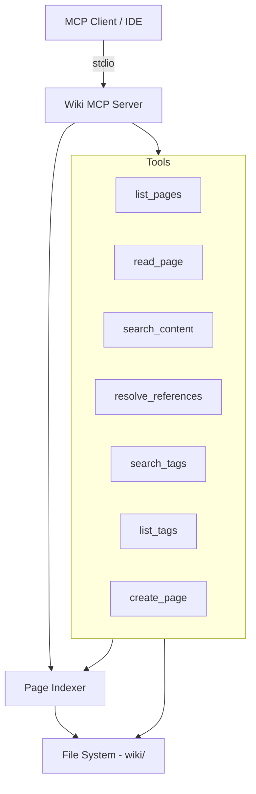

# Design Document: Wiki MCP Server

## Overview

A standalone Node.js MCP server that exposes the wiki knowledge base as queryable tools via the Model Context Protocol. The server reads markdown files with YAML frontmatter from a wiki directory, indexes them in memory, and provides tools for listing, reading, searching, cross-reference resolution, tag browsing, and content ingestion.

The server uses stdio transport, making it configurable from any project's MCP settings file. It depends on `@modelcontextprotocol/sdk` (already available at v1.26.0) and `gray-matter` for frontmatter parsing.

## Architecture



### Design Decisions

1. **In-memory index**: All frontmatter metadata and WikiLink references are loaded at startup. The wiki is small enough (dozens to low hundreds of pages) that full in-memory indexing is practical and provides instant query responses.

2. **Lazy content loading**: Full page content is read from disk on demand (read/search operations) rather than cached in memory, keeping the memory footprint small.

3. **Single-process, no watch**: The server indexes once at startup. If wiki files change externally, the server must be restarted. This keeps the implementation simple and avoids file-watcher complexity.

4. **gray-matter for parsing**: Already a project dependency. Handles YAML frontmatter extraction reliably.

5. **@modelcontextprotocol/sdk**: Already available at v1.26.0. Provides the `Server` class, stdio transport, and tool registration APIs.

## Components and Interfaces

### Entry Point (`src/wiki-mcp-server/index.ts`)

```typescript
// CLI entry point
// Parses args/env for wiki directory path
// Validates wiki structure
// Creates and starts the MCP server
```

### WikiIndex

Responsible for scanning the wiki directory and building the in-memory index.

```typescript
interface PageMeta {
  title: string;
  type: 'entity' | 'concept' | 'source';
  tags: string[];
  created: string;
  updated: string;
  filePath: string;        // relative to wiki root, e.g. "entities/angular-cdk.md"
  sources?: string[];
  author?: string;
  date?: string;
  url?: string;
  outgoingLinks: string[]; // WikiLink targets extracted from content
}

interface WikiIndex {
  pages: Map<string, PageMeta>;        // keyed by normalized title
  backlinks: Map<string, string[]>;    // target title -> list of source titles
  tags: Map<string, string[]>;         // tag -> list of page titles
}
```

**Key methods:**
- `buildIndex(wikiDir: string): Promise<WikiIndex>` — Scans all .md files in entities/, concepts/, sources/, parses frontmatter, extracts WikiLinks
- `validateStructure(wikiDir: string): { valid: boolean; error?: string }` — Checks for index.md and required subdirectories

### WikiLink Parser

Extracts `[[WikiLink]]` references from markdown content.

```typescript
function extractWikiLinks(content: string): string[];
// Returns array of link targets, handling:
// - [[Page Title]]
// - [[Page Title|Display Text]] -> extracts "Page Title"
// - [[Page Title#Section]] -> extracts "Page Title"
```

### Tool Handlers

Each MCP tool maps to a handler function:

| Tool Name | Parameters | Returns |
|-----------|-----------|---------|
| `wiki_list_pages` | `type?`, `tag?` | Array of `{title, type, tags, filePath}` |
| `wiki_read_page` | `title` or `path` | `{content, frontmatter, backlinks}` |
| `wiki_search` | `query` | Array of `{title, type, filePath, excerpt}` |
| `wiki_resolve_references` | `title` | `{outgoing: [{title, exists}], incoming: [title]}` |
| `wiki_search_tags` | `tags: string[]` | Array of `{title, type, filePath, tags}` |
| `wiki_list_tags` | none | Array of `{tag, count}` |
| `wiki_create_page` | `title, type, tags, content, sources?, author?, date?, url?` | `{filePath, title}` |

### Frontmatter Parser

Wraps `gray-matter` with validation and graceful error handling.

```typescript
interface ParseResult {
  success: boolean;
  meta?: PageMeta;
  error?: string;
}

function parseFrontmatter(filePath: string, rawContent: string): ParseResult;
```

### Search Engine

Simple in-memory full-text search (no external dependencies needed for the wiki's scale).

```typescript
function searchContent(wikiDir: string, index: WikiIndex, query: string): SearchResult[];

interface SearchResult {
  title: string;
  type: string;
  filePath: string;
  excerpt: string; // ~100 chars around match
}
```

## Data Models

### Page Metadata (in-memory)

```typescript
interface PageMeta {
  title: string;
  type: 'entity' | 'concept' | 'source';
  tags: string[];
  created: string;
  updated: string;
  filePath: string;
  sources?: string[];
  author?: string;
  date?: string;
  url?: string;
  outgoingLinks: string[];
}
```

### Tool Response Shapes

```typescript
// wiki_list_pages response
interface ListPagesResult {
  pages: Array<{
    title: string;
    type: string;
    tags: string[];
    filePath: string;
  }>;
}

// wiki_read_page response
interface ReadPageResult {
  title: string;
  content: string;
  frontmatter: Record<string, unknown>;
  backlinks: string[];
}

// wiki_search response
interface SearchContentResult {
  matches: Array<{
    title: string;
    type: string;
    filePath: string;
    excerpt: string;
  }>;
  totalMatches: number;
}

// wiki_resolve_references response
interface ResolveRefsResult {
  outgoing: Array<{ title: string; exists: boolean }>;
  incoming: string[];
}

// wiki_search_tags response
interface TagSearchResult {
  pages: Array<{
    title: string;
    type: string;
    filePath: string;
    tags: string[];
  }>;
}

// wiki_list_tags response
interface ListTagsResult {
  tags: Array<{ tag: string; count: number }>;
}

// wiki_create_page response
interface CreatePageResult {
  filePath: string;
  title: string;
}
```

### File Naming Logic

```typescript
function generateFileName(title: string, type: 'entity' | 'concept' | 'source'): string;
// entity/concept: kebab-case-noun.md
// source: source-title-yyyy-mm-dd.md
```


## Correctness Properties

*A property is a characteristic or behavior that should hold true across all valid executions of a system — essentially, a formal statement about what the system should do. Properties serve as the bridge between human-readable specifications and machine-verifiable correctness guarantees.*

### Property 1: Structure validation correctness

*For any* directory structure, the validator SHALL return valid=true if and only if the directory contains `index.md` and subdirectories `entities/`, `concepts/`, and `sources/`.

**Validates: Requirements 1.1, 1.2**

### Property 2: Index completeness

*For any* valid wiki directory containing N pages with valid frontmatter, building the index SHALL produce exactly N entries, one for each page.

**Validates: Requirements 1.4**

### Property 3: List filtering correctness

*For any* page index and optional type/tag filter, the list operation SHALL return exactly the set of pages matching all applied filters — all pages when no filter is applied, only pages of the specified type when type-filtered, and only pages containing the specified tag when tag-filtered.

**Validates: Requirements 2.1, 2.2, 2.3**

### Property 4: List results are sorted alphabetically

*For any* list result, the returned pages SHALL be sorted in case-insensitive alphabetical order by title.

**Validates: Requirements 2.4**

### Property 5: Read returns file content faithfully

*For any* page that exists in the index, reading it SHALL return content identical to the file on disk.

**Validates: Requirements 3.1**

### Property 6: Backlink correctness

*For any* page A in the index, the set of backlinks reported for A SHALL equal exactly the set of pages whose content contains a WikiLink targeting A.

**Validates: Requirements 3.3, 5.2**

### Property 7: Search result correctness

*For any* query string that appears (case-insensitively) in a page's content or title, that page SHALL appear in search results, and each result SHALL include title, type, filePath, and an excerpt containing the query.

**Validates: Requirements 4.1, 4.2**

### Property 8: Outgoing link resolution

*For any* page in the index, the outgoing links reported SHALL match exactly the WikiLinks extracted from that page's content, and each link's `exists` flag SHALL be true if and only if the target title exists in the index.

**Validates: Requirements 5.1, 5.3**

### Property 9: Tag search correctness

*For any* set of query tags, the tag search SHALL return exactly the pages that have at least one matching tag, and each result SHALL include title, type, filePath, and the page's full tag list.

**Validates: Requirements 6.1, 6.3**

### Property 10: Tag listing completeness

*For any* page index, listing tags SHALL return every unique tag present across all pages, and each tag's count SHALL equal the number of pages containing that tag.

**Validates: Requirements 6.2**

### Property 11: Frontmatter round-trip

*For any* valid wiki page metadata, serializing to YAML frontmatter then parsing back SHALL produce equivalent metadata.

**Validates: Requirements 8.1, 8.3**

### Property 12: Malformed frontmatter resilience

*For any* set of wiki files where some have valid frontmatter and some have malformed/missing frontmatter, the indexer SHALL include all valid pages and exclude all malformed pages without throwing.

**Validates: Requirements 8.2**

### Property 13: Filename generation follows naming conventions

*For any* valid title and page type, the generated filename SHALL be `kebab-case-noun.md` for entity/concept types, and `source-title-yyyy-mm-dd.md` for source types.

**Validates: Requirements 9.1, 9.5, 9.6**

### Property 14: Duplicate title rejection

*For any* page title that already exists in the index, attempting to create a page with that title SHALL return an error and not modify the file system.

**Validates: Requirements 9.4**

### Property 15: WikiLink extraction

*For any* markdown content containing WikiLinks in the forms `[[Title]]`, `[[Title|Display]]`, or `[[Title#Section]]`, the extractor SHALL return exactly the set of target titles.

**Validates: Requirements 5.1, 3.3**

## Error Handling

| Scenario | Behavior |
|----------|----------|
| Wiki directory doesn't exist | Return descriptive error, refuse to start |
| Missing required subdirectory | Return error naming the missing directory |
| Malformed frontmatter in a page | Log warning, skip page, continue indexing |
| Read request for non-existent page | Return MCP error with "page not found" message |
| Search with empty query | Return empty result set |
| Create page with existing title | Return MCP error with "page already exists" message |
| File I/O error during read | Return MCP error with filesystem error details |
| File I/O error during create | Return MCP error, do not leave partial files |
| Invalid page type in create request | Return MCP error with valid types listed |

All errors use MCP's standard error response format. The server never crashes on tool invocation errors — it returns structured error responses.

## Testing Strategy

### Property-Based Tests (fast-check + @fast-check/vitest)

The project already has `fast-check` (v4.7.0) and `@fast-check/vitest` (v0.4.1) installed. Each correctness property maps to a property-based test with minimum 100 iterations.

**Test tag format:** `Feature: wiki-mcp-server, Property {N}: {title}`

Key generators needed:
- `arbPageMeta()` — generates random valid PageMeta objects
- `arbFrontmatter()` — generates random valid YAML frontmatter strings
- `arbWikiContent()` — generates markdown with random WikiLinks
- `arbPageSet()` — generates a consistent set of pages with cross-references
- `arbMalformedFrontmatter()` — generates invalid YAML frontmatter

### Unit Tests (vitest)

Focused on specific examples and edge cases:
- WikiLink extraction edge cases (nested brackets, escaped brackets, empty links)
- Filename generation with special characters, unicode, very long titles
- Search with regex-special characters in query
- Index file update formatting
- CLI argument parsing (--wiki-dir, WIKI_DIR env var)

### Integration Tests

- Server startup and tool registration over stdio
- End-to-end: create page → list → read → search → verify cross-references
- Configuration from MCP settings file format

### Test File Organization

```
src/wiki-mcp-server/
├── __tests__/
│   ├── wiki-index.property.test.ts    # Properties 1-4, 12
│   ├── wiki-read.property.test.ts     # Properties 5-6
│   ├── wiki-search.property.test.ts   # Property 7
│   ├── wiki-refs.property.test.ts     # Properties 8, 15
│   ├── wiki-tags.property.test.ts     # Properties 9-10
│   ├── frontmatter.property.test.ts   # Property 11
│   ├── ingestion.property.test.ts     # Properties 13-14
│   ├── wikilink-parser.unit.test.ts   # Edge cases
│   ├── filename-gen.unit.test.ts      # Edge cases
│   └── server.integration.test.ts     # E2E
├── index.ts
├── wiki-index.ts
├── wikilink-parser.ts
├── frontmatter.ts
├── search.ts
├── tools/
│   ├── list-pages.ts
│   ├── read-page.ts
│   ├── search-content.ts
│   ├── resolve-references.ts
│   ├── search-tags.ts
│   ├── list-tags.ts
│   └── create-page.ts
└── filename-gen.ts
```


## Nx Build Infrastructure

### Project Structure Change

The server moves from `src/wiki-mcp-server/` to `apps/wiki-mcp-server/` to register it as a proper Nx application in the task graph. All existing source files move as-is; only the containing directory changes.

```
apps/wiki-mcp-server/
├── src/
│   ├── index.ts              # entry point (moved from src/wiki-mcp-server/index.ts)
│   ├── wiki-index.ts
│   ├── wikilink-parser.ts
│   ├── frontmatter.ts
│   ├── search.ts
│   ├── filename-gen.ts
│   ├── tools/
│   │   ├── list-pages.ts
│   │   ├── read-page.ts
│   │   ├── search-content.ts
│   │   ├── resolve-references.ts
│   │   ├── search-tags.ts
│   │   ├── list-tags.ts
│   │   └── create-page.ts
│   └── __tests__/
│       └── *.test.ts
├── project.json              # Nx target definitions
├── package.json              # bin field, private: false
├── tsconfig.json
├── tsconfig.app.json
└── vitest.config.ts
```

### project.json Target Definitions

```json
{
  "name": "wiki-mcp-server",
  "$schema": "../../node_modules/nx/schemas/project-schema.json",
  "projectType": "application",
  "sourceRoot": "apps/wiki-mcp-server/src",
  "targets": {
    "build": {
      "executor": "@nx/esbuild:esbuild",
      "outputs": ["{options.outputPath}"],
      "options": {
        "main": "apps/wiki-mcp-server/src/index.ts",
        "tsConfig": "apps/wiki-mcp-server/tsconfig.app.json",
        "outputPath": "dist/apps/wiki-mcp-server",
        "platform": "node",
        "format": ["cjs"],
        "bundle": true,
        "esbuildOptions": {
          "banner": { ".js": "#!/usr/bin/env node" }
        }
      }
    },
    "serve": {
      "executor": "@nx/js:node",
      "options": {
        "buildTarget": "wiki-mcp-server:build"
      }
    },
    "test": {
      "executor": "@nx/vite:test",
      "options": {
        "configFile": "apps/wiki-mcp-server/vitest.config.ts"
      }
    },
    "debug": {
      "command": "npx @modelcontextprotocol/inspector node dist/apps/wiki-mcp-server/main.js --wiki-dir=/path/to/wiki",
      "dependsOn": ["build"]
    }
  }
}
```

### Esbuild Configuration

esbuild is used instead of webpack for the following reasons:

- Simpler configuration — no webpack config file needed, all options inline in `project.json`
- Significantly faster builds — esbuild is 10–100x faster than webpack for Node bundles
- Native Node bundling — `platform: "node"` and `format: ["cjs"]` produce a clean CommonJS bundle without webpack runtime overhead
- Shebang injection via `esbuildOptions.banner` — the `#!/usr/bin/env node` line is injected directly into the output `.js` file by esbuild at bundle time, eliminating the need for any post-build script

The `bundle: true` option ensures all dependencies are inlined into the single output file, making the bundle self-contained for `npx` execution.

### package.json Changes

```diff
 {
   "name": "wiki-mcp-server",
   "version": "1.0.0",
   "description": "Standalone MCP server for querying a wiki knowledge base",
-  "private": true,
+  "private": false,
+  "bin": {
+    "wiki-mcp-server": "./dist/apps/wiki-mcp-server/main.js"
+  },
   "scripts": {
-    "build": "tsc -p tsconfig.build.json",
-    "test": "vitest run --config vitest.config.ts"
+    "test": "vitest run --config vitest.config.ts"
   }
 }
```

The raw `tsc` build script is removed — building is now handled exclusively by the `nx run wiki-mcp-server:build` target. The `bin` field enables `npx wiki-mcp-server --wiki-dir /path/to/wiki` after publishing. Setting `private: false` allows the package to be published to npm.

### MCP SDK API Fix

The current `index.ts` uses the deprecated 4-argument `server.tool` signature throughout all 7 tool registrations:

```typescript
// DEPRECATED — do not use
server.tool(name, description, schema, handler)
```

All registrations must be updated to the current object-form signature:

```typescript
// Current (non-deprecated) form
server.tool({
  name: 'wiki_list_pages',
  description: 'List wiki pages, optionally filtered by type and/or tag.',
  inputSchema: {
    type: z.enum(['entity', 'concept', 'source']).optional(),
    tag: z.string().optional(),
  },
  handler: async (params) => {
    const result = handleListPages(index, params);
    return { content: [{ type: 'text' as const, text: JSON.stringify(result, null, 2) }] };
  }
});
```

This applies to all 7 tool registrations: `wiki_list_pages`, `wiki_read_page`, `wiki_search`, `wiki_resolve_references`, `wiki_search_tags`, `wiki_list_tags`, and `wiki_create_page`.

### nx.json Updates

Add `targetDefaults` entries for the `build` and `test` targets to enable Nx caching scoped to project source files:

```json
{
  "targetDefaults": {
    "@nx/esbuild:esbuild": {
      "cache": true,
      "inputs": ["production", "^production"],
      "outputs": ["{options.outputPath}"]
    },
    "@nx/vite:test": {
      "cache": true,
      "inputs": ["default", "^production"]
    }
  }
}
```

These entries ensure that:
- The `build` target is cached and invalidated when project source files or their dependencies change
- The `test` target is cached and invalidated when source files change
- Both targets benefit from Nx's remote cache when running in CI
