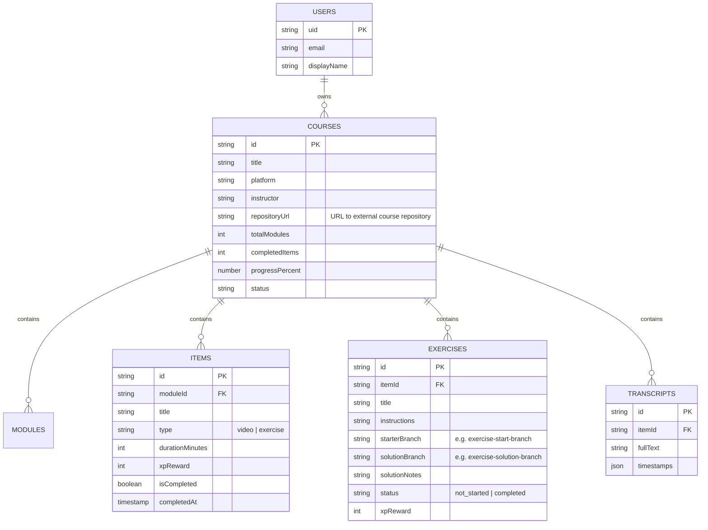

# ADR-0011: Firebase-Only Course Data Persistence, Transcripts & Exercise Storage, and Repository Sanitization

## Status

**Accepted**

---

## Context & Problem Statement

With the introduction of Daily Course Progression and Authenticated Web Scraping Ingestion ([ADR-0010](0010-daily-course-progression-and-agent-ingestion.md)), the Life Gamification Platform ingests technical courses containing multi-layered learning assets:
- **General Course Metadata & Syllabus**: Platform information, module breakdowns, lecture titles, descriptions, and learning targets.
- **Lesson Transcripts & Video Captions**: Detailed textual transcriptions, timestamps, and slide notes.
- **Hands-On Exercises & Coding Labs**: Exercise descriptions, instructions, starter code, test requirements, and solution walkthroughs.
- **Companion Code Repositories & Starter Workspaces**: External Git repositories accompanying courses containing boilerplate code, exercise starter templates, solution branches, and project sandboxes.

During early prototyping and ingestion testing, raw scraped course payloads, exercise files, transcript dumps, and hardcoded JSON fixtures were placed directly into the Git repository tree.

Committing third-party course materials, copyrighted transcripts, proprietary exercise datasets, or cloning external course codebases directly into the monorepo introduces critical risks and architectural flaws:

1. **Intellectual Property (IP) & Copyright Exposure**: External technical courses, proprietary learning portals, paid platform materials, and copyrighted course repositories cannot legally or ethically be bundled or distributed inside an open-source or shared Git codebase.
2. **Repository Bloat & Monorepo Performance Degradation**: Raw transcript files, video captions, exercise assets, and nested git repositories/node_modules create large binary/text footprints that unnecessarily bloat Git clone times, inflate repository history, and clutter diff reviews.
3. **Multi-Tenancy & User Isolation Violation**: Storing static course JSON in the repository forces a static, single-course view across all users. Each user requires their own isolated course catalog, individualized progress states, personal exercise submissions, personal sandbox forks, and customized learning notes.
4. **Violation of Stateless Application Principles**: Application source code (`apps/life-forge-app`, `libs/character/*`) must remain strictly stateless and decoupled from user data. Application builds should never bundle private user content.

---

## Decision Drivers

- **Zero Proprietary Data in VCS (Strict Repository Sanitization)**: No copyrighted course information, general course metadata, lecture transcripts, exercise instructions, or external course code repositories may exist in the Git repository.
- **Companion Course Code Repository Isolation**: External course code repositories are referenced strictly by URL/metadata in Firestore (`repositoryUrl`, `starterBranch`, `solutionBranch`, `exerciseCommitSha`) rather than embedded into the monorepo. Student work occurs in external student forks or git-ignored local sandboxes.
- **Direct-to-Cloud Ingestion 
Pipeline**: Course scrapers and agent ingestion workflows must persist parsed curricula, transcripts, and exercises directly into Firebase (Cloud Firestore & Firebase Cloud Storage) without writing persistent tracking files to the repository.
- **Granular Multi-Tenant Cloud Storage**:
  - Structured course metadata, modules, lessons, exercise states, and repository links are persisted in **Cloud Firestore** under user-isolated subcollections (`users/{userId}/courses/{courseId}/**`).
  - Large-volume transcript payloads, lecture captions, and supplementary documents are stored in **Firebase Cloud Storage** or dedicated Firestore subcollections secured by per-user security rules.
- **Repository Hygiene & `.gitignore` Enforcement**: Exclude all raw scraping dumps (`raw/**`, `fixtures/**`, `sandboxes/**`) from source control.
- **Clean Architecture Decoupling**: Frontend components and services (`CourseStorageAdapter`, `CourseStateService`) interact exclusively through reactive Firestore ports and repositories, using dynamically generated in-memory mocks strictly for isolated unit tests.

---

## Technical Specifications & Architecture

### 1. Cloud-Native Firestore Data Model

Course data is structured hierarchically within the authenticated user's Firestore document tree, ensuring strict data isolation:

```text
users/{userId}/
  ├── character/ (stats, level, totalXp)
  ├── xp_events/ (immutable time-series log)
  └── courses/{courseId}
        ├── (Document: Course Metadata, title, platform, totalModules, completedCount, progressPercent)
        │
        ├── modules/{moduleId}
        │     └── (Document: title, order, totalDurationMinutes, xpReward)
        │
        ├── items/{itemId}
        │     └── (Document: title, type: 'video' | 'exercise', durationMinutes, xpReward, isCompleted, completedAt)
        │
        ├── exercises/{exerciseId}
        │     └── (Document: title, instructions, codePrompt, status: 'pending' | 'submitted' | 'reviewed', xpReward)
        │
        └── transcripts/{itemId}
              └── (Document: itemId, language, cues: [{ startTime, endTime, text }], fullText)
```



---

### 2. Direct-to-Firebase Ingestion Workflow

When an AI agent or user runs a course ingestion task via Chrome DevTools MCP or the CLI:

1. **Extraction in Memory**: The agent navigates the authenticated course portal and extracts the curriculum structure, exercises, transcripts, and companion repository links into temporary in-memory payloads.
2. **Direct Firestore / Storage Upload**:
   - Course metadata (including companion repository URLs), modules, and items are batch-written to `users/{userId}/courses/{courseId}`.
   - Transcripts and large exercise briefs are written to `users/{userId}/courses/{courseId}/transcripts/{itemId}` (or Firebase Cloud Storage for payloads > 1 MB).
3. **Zero Local Artifact Retention**: No markdown, JSON files, or cloned repositories are committed to repository directories. Local temporary scrape caches are stored exclusively in ignored directories (e.g. `.cache/` or `.kiro/scratch/`).

```text
┌───────────────────────────┐      ┌───────────────────────────┐      ┌───────────────────────────┐
│  Browser / Scraper Agent  │ ───► │  In-Memory Normalization  │ ───► │      Cloud Firestore      │
│  (Authenticated Session)  │      │     (Zero Local Files)    │      │  users/{uid}/courses/**   │
└───────────────────────────┘      └───────────────────────────┘      └───────────────────────────┘
```

---

### 3. Declarative Security Rules (`firestore.rules`)

To enforce strict user data privacy and prevent unauthorized access to personal course notes, transcripts, and progress:

```javascript
rules_version = '2';
service cloud.firestore {
  match /databases/{database}/documents {

    function isAuthenticated() {
      return request.auth != null;
    }

    function isOwner(userId) {
      return isAuthenticated() && request.auth.uid == userId;
    }

    match /users/{userId} {
      allow read, write: if isOwner(userId);

      // Course persistence rules
      match /courses/{courseId} {
        allow read, write: if isOwner(userId);

        match /{document=**} {
          allow read, write: if isOwner(userId);
        }
      }
    }
  }
}
```

---

### 4. Migration & Transition Strategy (Phased Ingestion & Non-Deletion Safeguard)

Because previously scraped course datasets, fixtures, exercises, and transcripts currently reside inside the monorepo from earlier extraction sessions, a strict three-phase migration process is established:

```text
┌──────────────────────────────────────────────────────────────────────────────────────────────────┐
│  Phase 1: Existing Local Data Seeding                                                            │
│  • Retain ALL existing local course files (fixtures, transcripts, exercises).                    │
│  • Run cloud migration/seeding script to parse and upload all existing data into Firebase.        │
│  • DO NOT delete any local files until full database upload and integrity are verified.          │
└──────────────────────────────────────────────┬───────────────────────────────────────────────────┘
                                               │
                                               ▼
┌──────────────────────────────────────────────────────────────────────────────────────────────────┐
│  Phase 2: Post-Upload Repository Sanitization & Verification                                     │
│  • Verify all course documents, modules, items, exercises, and transcripts in Cloud Firestore.   │
│  • Remove local raw dumps and fixture JSON from git tracking.                                    │
│  • Add raw scrape directories to `.gitignore`.                                                   │
└──────────────────────────────────────────────┬───────────────────────────────────────────────────┘
                                               │
                                               ▼
┌──────────────────────────────────────────────────────────────────────────────────────────────────┐
│  Phase 3: Ongoing Automated Scraping via MCP                                                     │
│  • Future course scraping uses AI Agent MCP tools (Chrome DevTools MCP).                         │
│  • Extracted data is streamed and written directly to Cloud Firestore / Firebase Cloud Storage.  │
│  • Zero files are created or committed to the Git repository during scraping.                    │
└──────────────────────────────────────────────────────────────────────────────────────────────────┘
```

> [!IMPORTANT]
> **Strict Non-Deletion Rule**: Existing local course files in the repository MUST NOT be deleted or discarded before their contents have been completely uploaded and verified inside the Cloud Firestore database.

---

### 5. Repository Sanitization & Git Hygiene Post-Upload

Once Phase 1 data migration and verification are complete, the following steps enforce ongoing repository cleanliness:

1. **Removal of Static Fixtures**: Remove static JSON course files from `libs/character/data-access/` and replace with programmatic test mock factories.
2. **Gitignore Raw Scrape Dumps**: Add `raw/` and all scraped course dumps to `.gitignore`.
3. **Companion Repository Isolation**: Never clone companion course codebases into the monorepo root. Students clone or fork to external sandbox directories or personal Git accounts.
4. **Dynamic Cloud Fetching**: Update `CourseStorageAdapter` to fetch real-time course lists and curricula from Firestore via `collection(firestore, 'users', userId, 'courses')`.

---

## Consequences

### Positive

- **100% IP & Copyright Compliance**: Proprietary course content, paid video transcripts, and proprietary exercise questions are never checked into public or shared version control.
- **Lean Repository & Fast Git Operations**: Monorepo size remains minimal, preventing git history bloat and speeding up CI/CD pipeline clone times.
- **True Multi-Tenancy & Synchronization**: Every user accesses their own course catalog and progress across mobile, desktop, and web apps through Firebase real-time listeners.
- **Clean Architecture Integrity**: Strict separation of concerns between runtime domain entities and persistent cloud storage.

### Negative & Trade-offs

- **Cloud Connectivity Requirement**: Real course data requires an active internet connection or the local Firebase Emulator Suite running for local development.
- **Offline Development Strategy**: Unit tests and offline local prototyping rely on in-memory mock factories rather than static repository fixture files.

---

## Graph Relationships & Cross References

- Extends [[ADR-0004]]: Character Dashboard and Life Gamification Platform
- Extends [[ADR-0005]]: Firebase Deployment & Firestore Data Persistence Architecture
- Implements Storage Policy for [[ADR-0010]]: Daily Course Progression and Authenticated Web Scraping Ingestion
- Cross-references [[Cloud Firestore]] and [[Security Rules]]
