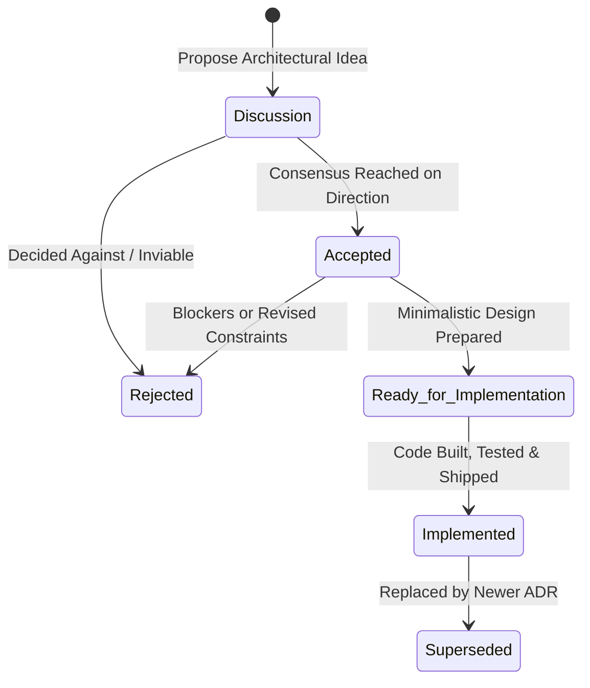

# ADR-0012: Architecture Decision Record Lifecycle Statuses and Decision Workflow

## Status

**Implemented**

---

## Context & Problem Statement

Prior to this decision, Architecture Decision Records (ADRs) in this repository utilized a coarse status taxonomy (principally `accepted`, `proposed`, `deprecated`, `superseded`). While simple, this taxonomy did not provide adequate visibility into where an architectural initiative currently stands within the software engineering and delivery lifecycle.

Specifically:
1. **Uncertain Explorations**: There was no standard status for recording architectural questions and trade-off explorations where the team is not yet sure what decision to make.
2. **Ambiguity Between Approval and Delivery**: Marking an ADR as `Accepted` conflated high-level agreement with actual delivery in the codebase. Contributors and AI coding agents could not easily tell whether an ADR represented a planned future system or active, working code.
3. **Missing "Ready to Code" Gate**: There was no explicit milestone indicating that architectural consensus had been refined into a minimalistic technical design (contracts, interfaces, component boundaries, and testing plans) ready for immediate engineering execution.
4. **Preserving Declined Proposals**: When an architectural direction was evaluated and decided against, there was no standardized `Rejected` status to capture the negative rationale and preserve institutional memory.

We needed a structured, 5-state lifecycle workflow for ADRs that provides unambiguous operational clarity for both human contributors and autonomous AI agents.

---

## Decision Drivers

- **Lifecycle Transparency**: Clearly demarcate the journey from initial exploration to working production code.
- **Prevent Premature Implementation**: Introduce an explicit design readiness checkpoint (`Ready for Implementation`) before code is written.
- **Institutional Memory Preservation**: Formally document rejected architectural paths so past trade-offs are not repeatedly re-debated.
- **Codebase Truth Alignment**: Ensure that any ADR marked `Implemented` corresponds to verified, functional code in the repository.
- **Simplicity and Tooling Ergonomics**: Keep the statuses intuitive, easy to parse programmatically, and aligned with monorepo indexing tools.

---

## Considered Options

1. **Option 1: Retain Binary `Proposed` / `Accepted` Model**
   - *Pros*: Minimal overhead.
   - *Cons*: Fails to distinguish between architectural approval, design readiness, and actual code delivery; leaves exploratory discussions undocumented.

2. **Option 2: Extensive Multi-Stage Agile/Jira-style States** (Draft, In-Review, Approved, Backlog, In-Progress, QA, Done)
   - *Pros*: Tracks granular project management phases.
   - *Cons*: Overly bureaucratic for ADRs; mixes architectural governance with sprint issue tracking.

3. **Option 3: 5-Tier Architectural Lifecycle Taxonomy (Chosen)**
   - *Pros*: Captures the exact architectural progression: exploratory deliberation (`Discussion`), strategic agreement (`Accepted`), deliberate abandonment (`Rejected`), finalized technical specification (`Ready for Implementation`), and verified codebase delivery (`Implemented`).
   - *Cons*: Requires retroactive migration of existing ADRs to match the new status semantics.

---

## Decision Outcome

We decided on **Option 3: 5-Tier Architectural Lifecycle Taxonomy**.

### The 5 Architectural Statuses

| # | Status | Description | Exit Criteria |
| - | ------ | ----------- | ------------- |
| 1 | **`Discussion`** | The architectural topic or proposed pattern is under active exploration. We are not yet sure what decision to make. Options are being gathered, trade-offs analyzed, and alternatives benchmarked. | Consensus is reached to approve (moves to `Accepted`) or turn down the idea (moves to `Rejected`). |
| 2 | **`Accepted`** | Architectural consensus has been reached; the high-level approach and direction are approved by the team. However, detailed technical design and interface specifications may still need to be drafted. | A minimalistic technical design is prepared (advances to `Ready for Implementation`) or revised constraints force abandonment (moves to `Rejected`). |
| 3 | **`Rejected`** | The proposal was thoroughly considered and explicitly declined. The evaluated alternatives and rationale for rejection are preserved permanently to document why this route was not selected. | Terminal state. Can only be revisited if foundational assumptions or technologies change fundamentally. |
| 4 | **`Ready for Implementation`** | A minimalistic technical design has been prepared. Domain models, data contracts, component boundaries, storage schemas, and verification criteria are defined. Implementation can begin immediately without architectural ambiguity. | Implementation is completed, tested, and documented (advances to `Implemented`). |
| 5 | **`Implemented`** | The architectural decision is fully realized in the codebase, integrated into application targets, and verified with automated tests and documentation. | If later replaced by a newer architectural paradigm, transitions to `Superseded`. |

---

## Lifecycle State Machine

---

## Retroactive Audit & Migration of Existing ADRs

As part of adopting this standard, all previous ADRs (ADR-0001 through ADR-0011) were audited against the active codebase:

1. **[ADR-0001](0001-monorepo-structure-and-hexagonal-wiki-core.md)**: `Accepted` $\rightarrow$ **`Implemented`** (`libs/wiki/*` ports, adapters, and domain models are live).
2. **[ADR-0002](0002-interactive-knowledge-graph-and-learning-engine.md)**: `Accepted` $\rightarrow$ **`Implemented`** (`apps/wiki-graph` with D3 force simulation and learning engine is live).
3. **[ADR-0003](0003-model-context-protocol-mcp-server-integration.md)**: `Accepted` $\rightarrow$ **`Implemented`** (`apps/wiki-mcp-server` stdio bridge is live).
4. **[ADR-0004](0004-character-dashboard-and-life-gamification-architecture.md)**: `Accepted` $\rightarrow$ **`Implemented`** (`apps/life-forge-app` and `libs/character/*` are live).
5. **[ADR-0005](0005-firebase-deployment-and-firestore-persistence.md)**: `Accepted` $\rightarrow$ **`Implemented`** (Firebase Hosting and Firestore adapters are configured and active).
6. **[ADR-0006](0006-action-based-xp-engine-and-early-wake-up-quests.md)**: `Accepted` $\rightarrow$ **`Implemented`** (Action-based XP engine and early wake-up quests are live in domain models).
7. **[ADR-0007](0007-book-reading-daily-quest-and-reading-log.md)**: `Accepted` $\rightarrow$ **`Implemented`** (Active reading shelf, page-tracking quests, and monthly archive are live).
8. **[ADR-0008](0008-google-auth-allowlist-and-level-1-baseline-onboarding.md)**: `Accepted` $\rightarrow$ **`Implemented`** (Google OAuth allowlist guard and Level 1 baseline onboarding are live).
9. **[ADR-0009](0009-firestore-time-series-xp-event-logging-for-data-visualization.md)**: `Accepted` $\rightarrow$ **`Implemented`** (Firestore XP event persistence and time-series models are live).
10. **[ADR-0010](0010-daily-course-progression-and-agent-ingestion.md)**: `Accepted` $\rightarrow$ **`Implemented`** (Daily course quests, curriculum accordion, and check-in modals are live).
11. **[ADR-0011](0011-firebase-only-course-data-persistence-and-repository-sanitization.md)**: `Accepted` $\rightarrow$ **`Implemented`** (Firebase course persistence and repository sanitization are live).
12. **[ADR-0012](0012-adr-lifecycle-statuses-and-decision-workflow.md)**: Established as **`Implemented`** simultaneously with the repository migration.

---

## Consequences

### Positive

- **Clarity of Intent**: Anyone reading an ADR immediately knows if it is an open question (`Discussion`), an approved goal (`Accepted`), a ready-to-build spec (`Ready for Implementation`), or live code (`Implemented`).
- **Elimination of Guesswork for AI Agents**: Autonomous agents will not attempt to consume or depend on an ADR that is only in `Discussion` or `Accepted` without checking if it reached `Ready for Implementation` or `Implemented`.
- **Preserved Rationale for Rejections**: Discarded technical paths are documented with their trade-offs under `Rejected`, preventing future redundant debates.

### Negative & Trade-offs

- **Lifecycle Maintenance**: Authors and reviewers must keep ADR statuses updated as features move from design to implementation.

---

## Graph Relationships & Cross References

- Refines [[ADR-0001: Monorepo Structure & Hexagonal Architecture for Wiki Core]]
- Standardizes ADR ingestion for [[ADR-0003: Model Context Protocol (MCP) Server for AI Agent Integration]]
