# ADR-0013: ADHD-Friendly Streamlined Character Dashboard and Frictionless One-Click Quest Completion

## Status

**Accepted**

---

## Context & Problem Statement

The **Life Gamification Platform** ([ADR-0004](0004-character-dashboard-and-life-gamification-architecture.md)) has evolved with rich features:
- Early morning waking discipline quests ([ADR-0006](0006-action-based-xp-engine-and-early-wake-up-quests.md))
- Active reading shelf, page-tracking quests, and monthly archives ([ADR-0007](0007-book-reading-daily-quest-and-reading-log.md))
- Firestore time-series XP event audit logging ([ADR-0009](0009-firestore-time-series-xp-event-logging-for-data-visualization.md))
- Daily course progression, curriculum accordions, and reflection check-in modals ([ADR-0010](0010-daily-course-progression-and-agent-ingestion.md))

However, co-locating all these features on the main **Character Dashboard** (`apps/life-forge-app`, `libs/character/feature-dashboard`) has created significant **information overload and friction**:

1. **Cognitive Overload & Visual Clutter**:
   - The primary action column simultaneously renders active course quest cards, full multi-module curriculum accordions, waking slot matrices, simulation widgets, an active book shelf with multiple cards and progress bars, a monthly completed books archive filter, and a live time-series XP audit log table.
   - For users with **ADHD, neurodivergence, or executive dysfunction**, this density of competing stimuli causes sensory overload, decision paralysis, and severe cognitive fatigue.

2. **High Interaction Friction (Modals and Mandatory Inputs)**:
   - Completing a daily study quest currently opens `CourseItemCheckinModalComponent`, demanding cognitive effort to input reflection notes, key takeaways, and time spent.
   - Completing a daily reading quest opens `isLogQuestModalOpen`, requiring the user to look up their exact finished page number, calculate progress, and submit a multi-field form.
   - Adding or updating books involves blocking modal overlays (`isAddBookModalOpen`).
   - Modals and popups break flow state, create visual disruption, and impose an artificial barrier to habit execution.
   - While users value tracking their real-world reading volume (**how many pages read this day**), forcing them into a popup modal with page subtraction math introduces unnecessary friction.

3. **The Executive Dysfunction & Habit Abandonment Trap**:
   - In behavioral psychology and ADHD ergonomics, habit formation depends on **low activation energy** and **immediate dopamine feedback**.
   - When a daily check-in feels like filling out an administrative report, users postpone the task, break their daily streak, and ultimately abandon the platform.

We need an architectural and UX overhaul that streamlines the Character Dashboard, enforces **frictionless 1-click quest completion with zero mandatory modals or popups**, preserves the **ability to specify exactly how many pages were read this day inline**, and moves supplementary metadata entry to **non-blocking, strictly optional progressive disclosure**.

---

## Decision Drivers

- **Zero-Friction Habit Execution**: Completing any active daily quest (study, reading, waking) must be achievable in **exactly one click** directly from the dashboard view.
- **No Modals, No Popups**: Never interrupt the user with blocking dialogs, mandatory forms, or alert popups during daily quest execution.
- **First-Class Inline Reading Volume Tracking**: Users must retain the ability to record exactly how many pages they read this day (e.g., 10, 25, 50 pages) directly inline on the card with zero popups, while also allowing instant 1-click completion using a smart pre-filled default.
- **ADHD-Centric Cognitive Ergonomics**: Minimize simultaneous visual stimuli; emphasize the single immediate "Next Action" (Today's Focus) rather than expansive historical logs and multi-nested trees.
- **Progressive Disclosure for Optional Data**: Allow users to attach reflections, notes, or additional metadata if they want to, but keep this entirely optional, inline, and non-blocking.
- **Immediate Dopamine & XP Feedback**: Provide instant visual reward states (sound, micro-confetti/pulse, reactive stat bar advancement) upon clicking, with zero latency or intermediate hurdles.
- **Decoupled Architecture & Domain Integrity**: Retain full support for rich time-series and curriculum tracking in domain layers without forcing UI layers to demand all fields synchronously.

---

## Considered Options

### Option 1: Keep Modals but Auto-Fill Defaults
- *Approach*: Retain existing modals (`CourseItemCheckinModalComponent`, `isLogQuestModalOpen`), but auto-populate default page numbers and placeholder reflection notes, allowing the user to simply click "Submit".
- *Pros*: Minimal changes to existing component architecture.
- *Cons*: Modals still physically appear, causing visual context shifts and requiring at least two clicks (open modal $\rightarrow$ confirm). Fails to solve ADHD friction and visual disruption.

### Option 2: Configurable "ADHD Mode" Toggle / View Switcher
- *Approach*: Add a toggle switch (e.g. "Compact / Minimalist View" vs. "Detailed / Power-User View") on the dashboard.
- *Pros*: Preserves the dense layout for users who desire full data visibility.
- *Cons*: Adds configuration overhead, introduces state fragmentation, and violates clean design principles. If a layout is overwhelming for users with ADHD, a streamlined default design improves usability for all users.

### Option 3: Streamlined Focus Dashboard with 1-Click Completion & Inline Page Input (Chosen)
- *Approach*:
  1. Redesign dashboard into a unified, clean **"Today's Active Quests"** command center.
  2. Implement **Frictionless Completion** directly on the cards:
     - **Study Quest**: Direct `[⚡ Complete Next Lesson (+35 INT)]` button on the card. Instantly advances the course, logs default XP, and marks today's quest complete.
     - **Reading Quest with Inline Pages Read**: The card displays the active book and an **inline page counter** (pre-filled with a smart default, e.g. 15 pages or user's daily goal).
       - *Pure 1-Click path*: Click `[📖 Log 15 Pages (+40 WIS)]` directly to accept the default.
       - *Custom pages path*: User can type or tap `[ - ] [ 25 ] [ + ] pages read today` right on the card and click `[📖 Log 25 Pages]`. Zero modals, zero popups.
     - **Waking Quest**: Direct `[⚡ Claim Wake-Up XP]` button (already single-click).
  3. **Zero Modals / Popups**: Completely eliminate modal dialogs for daily quest check-ins.
  4. **Non-Mandatory Inline Details**: Provide a subtle, collapsible inline link/drawer (e.g. `"Add notes / reflections ▾"`) directly under the quest card. If ignored, the quest is already 100% complete.
  5. **De-clutter Primary Dashboard**:
     - Move the **Time-Series XP Audit Log** out of the main action flow into a secondary collapsible drawer or dedicated `/analytics` tab.
     - Collapse the expansive **Course Curriculum Accordion** behind an optional `"View Full Syllabus"` toggle, keeping only the active item visible by default.
     - Hide the **Monthly Reading Archive** behind a secondary drawer or tab.


---

## Decision Outcome

We decided on **Option 3: Streamlined Focus Dashboard with 1-Click Completion & Inline Progressive Disclosure**.

### 1. One-Click Quest Interaction Lifecycle

```mermaid
sequenceDiagram
    autonumber
    actor User as User (ADHD Ergonomics)
    participant UI as Streamlined Quest Card
    participant State as Character / Course / Book State Service
    participant XP as Action-Based XP Engine
    participant DB as Firestore (Async Background)

    Note over User,UI: Zero Modals • Zero Popups • 1 Click or Quick Inline Stepper
    User->>UI: Clicks "⚡ Complete Lesson" or "📖 Log [X] Pages"
    
    rect rgb(30, 45, 60)
        Note over UI,State: Optimistic, Instantaneous UI Feedback
        UI->>State: completeActiveQuest(questId, { pagesRead: X })
        State->>XP: calculateAndApplyXp(reward)
        State-->>UI: Reactive Signal Updates (Level, DIS/WIS/INT XP, Quest Done)
        UI->>User: 🎉 Immediate Micro-Animation & Success Banner
    end

    opt Optional Enrichment (Non-blocking, Inline Drawer)
        User->>UI: (Optional) Expands "Add Notes / Reflections"
        User->>UI: Types notes or reflections
        UI->>State: enrichQuestMetadata(questId, optionalNotes)
    end

    State->>DB: Persist Course/Book Progress & XP Event (Background)
```



---

## Technical Specifications & Architecture

### 1. Domain Model Changes: Reading & Study Quests

In `libs/character/domain-models`, quest completion methods accept optional metadata rather than requiring strict form inputs, giving first-class support for specifying pages read this day directly:

```typescript
/**
 * Payload for logging a daily reading quest.
 * pagesReadThisDay defaults to a smart value (e.g. 15 pages or daily target),
 * but can be freely typed or stepped inline on the card.
 */
export interface ReadingQuestCompletionPayload {
  bookId: string;
  pagesReadThisDay?: number;   // e.g. 25 pages read today (inline stepper/input)
  finishedPage?: number;       // optional absolute page number
  notes?: string;              // optional reflection notes
}

/**
 * Optional enrichment metadata supplied by user post-completion or via inline drawer.
 * Never mandatory for quest completion.
 */
export interface QuestEnrichmentPayload {
  notes?: string;
  keyTakeaways?: string[];
  timeSpentMinutes?: number;
}

export interface QuestCompletionResult {
  questId: string;
  questType: 'study' | 'reading' | 'early-wakeup';
  completedAt: string;
  xpAwarded: number;
  statType: 'INT' | 'WIS' | 'DIS';
  nextItemTitle?: string;
  newCurrentPage?: number;
}
```

### 2. Reading Quest Inline UI Wireframe

```text
┌────────────────────────────────────────────────────────────────────────┐
│ 📚 Daily Quest: Active Book Reading                                    │
│ Book: "Clean Architecture" by Robert C. Martin                         │
│ Progress: Page 140 of 350 [████████░░░░░░░░░░░░] 40%                  │
│                                                                        │
│ How many pages did you read today?                                     │
│ [ - ]  [ 15 ] pages  [ + ]    (or type custom: [ 15 ])                │
│                                                                        │
│ ┌────────────────────────────────────────────────────────────────────┐ │
│ │ 📖 Log 15 Pages (+40 WIS & +10 DIS XP)                             │ │
│ └────────────────────────────────────────────────────────────────────┘ │
│                                                                        │
│ ▾ Add notes or reflections (strictly optional, non-blocking)          │
└────────────────────────────────────────────────────────────────────────┘
```

- **Frictionless 1-Click Execution**: If the user doesn't want to think about page counts, they simply click the primary button with the pre-filled default (e.g. 15 pages) in **1 click**.
- **Accurate Daily Page Tracking**: If the user read a specific number of pages (e.g., 27 pages), they adjust the inline input right on the card and click. Zero popups, zero modal backdrop overlays, zero context switches.

### 3. Streamlined Dashboard Component Boundaries

The dashboard layout in `libs/character/feature-dashboard` is refactored into focused, low-cognitive-load components:

```text
libs/character/feature-dashboard/src/lib/
├── character-dashboard.component.ts        # Main orchestrator (Clean 2-column layout)
├── character-dashboard.component.html
├── character-dashboard.component.scss
└── components/
    ├── streamlined-quest-list/             # Single focus card list: Today's Quests
    │   ├── daily-study-quest-card.component.ts    # 1-Click complete + optional inline notes drawer
    │   ├── daily-reading-quest-card.component.ts  # Inline pages stepper/input + 1-Click complete + optional notes
    │   └── daily-wakeup-quest-card.component.ts   # 1-Click wake-up claim
    ├── course-curriculum-drawer/           # Collapsible on-demand syllabus
    ├── reading-shelf-drawer/               # Collapsible library & monthly archive
    └── xp-analytics-drawer/                # Collapsible time-series event audit log
```

### 4. ADHD Ergonomics & UI Principles

| UI Element | Legacy Design (ADR-0007, 0009, 0010) | Streamlined ADHD-Friendly Design (ADR-0013) |
| :--- | :--- | :--- |
| **Pages Read Input** | Buried in modal; required calculating exact target page number. | **Directly inline on card** with stepper `[ - ] [ 15 ] [ + ]` and direct typing. |
| **Reading Quest Check-in** | Opens modal dialog with required fields, validation errors, and cancel/submit. | **1-Click on card**: logs pages directly with instant celebration. |
| **Study Quest Check-in** | Opens modal with notes, takeaways, minutes, and submit button. | **1-Click button** on card: immediately advances item & awards XP. |
| **Notes & Reflections** | Mandatory or blocking input field inside modal dialog. | **Optional inline drawer**: expands only if requested, never blocks completion. |
| **Curriculum Structure** | Full nested multi-module accordion rendered directly on dashboard. | Only **Next Up Item** displayed; full syllabus collapsed behind toggle. |
| **Time-Series Audit Log** | 10-row audit list permanently taking up 30% of dashboard vertical space. | Relocated into **collapsible analytics drawer** or secondary tab. |
| **Completed Books Archive** | Filterable archive table visible inline with daily reading shelf. | Accessible via **"View Archive" drawer**, reducing immediate visual noise. |
| **Completion Friction** | 3 to 5 clicks + typing + modal navigation. | **Exactly 1 click** (or 1 tap to adjust pages), 0 modal dialogs. |


---

## Consequences

### Positive

- **Dramatically Reduced Activation Energy**: Users with ADHD or low executive function can log habits in < 2 seconds without facing cognitive roadblocks.
- **Zero Modal Fatigue**: Eliminates jarring backdrop overlays, keyboard focus traps, and modal closing friction.
- **High Retention & Streak Preservation**: Minimizing friction directly correlates with daily streak retention and habit consistency.
- **Cleaner Dashboard Hierarchy**: Primary screen space is preserved for "What do I need to do right now?" (Today's Focus) rather than historical data dumps.
- **Preserved Analytical Integrity**: Optional details can still be captured via inline progressive disclosure for power users without penalizing minimalists.

### Negative & Trade-offs

- **Less Verbose Study Notes by Default**: Because reflection notes are no longer prompted in a blocking modal, some users may write fewer notes.
  - *Mitigation*: Provide a friendly, non-intrusive post-completion inline prompt: *"Great job! Want to jot down a quick takeaway? [Add Note ▾]"*.
- **Auto-Calculated Reading Pages May Require Occasional Reconciliation**: 1-click reading increments by a standard chunk (e.g. 15 pages) which may differ from the exact physical page reached.
  - *Mitigation*: The inline drawer allows quick 1-tap correction of the current page number at any time without opening a modal.

---

## Graph Relationships & Cross References

- **Refines** [[ADR-0004: Character Dashboard and Life Gamification Architecture]] — Restructures dashboard layout to prioritize low cognitive load and focus.
- **Refines** [[ADR-0007: Book Reading Daily Quest, Active Reading Shelf, and Monthly Reading Archive]] — Replaces modal page logging with 1-click completion and optional page delta reconciliation.
- **Refines** [[ADR-0009: Firestore Time-Series XP Event Logging for Data Visualization]] — Moves time-series audit log out of primary visual real estate into secondary disclosure.
- **Refines** [[ADR-0010: Daily Course Progression, Authenticated Web Scraping Ingestion, and Action-Based Learning Architecture]] — Replaces blocking check-in modal with 1-click course progression.
- **Complies With** [[ADR-0012: Architecture Decision Record Lifecycle Statuses and Decision Workflow]] — Enters lifecycle in **Accepted** status.
