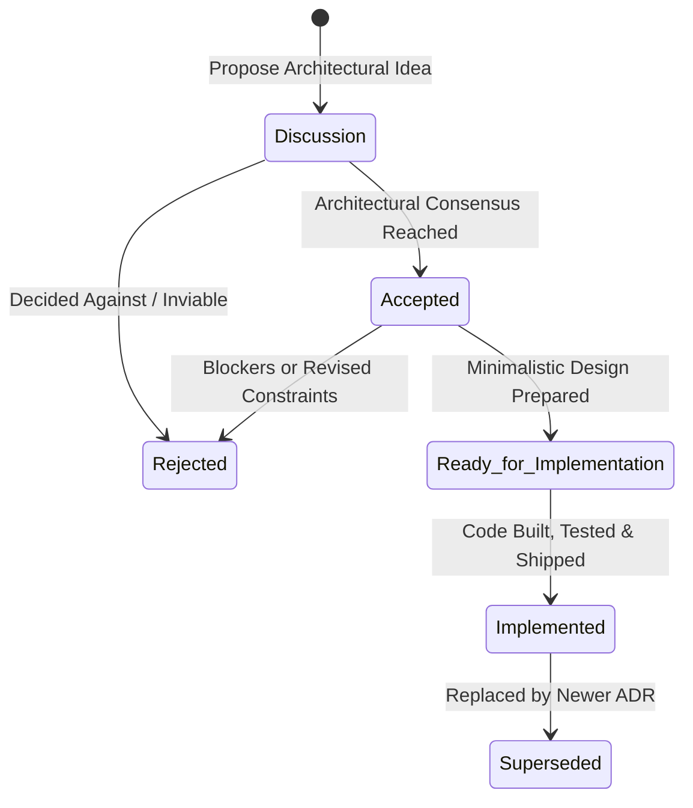

# Architecture Decision Records (ADRs)

This directory contains Architecture Decision Records (ADRs) capturing significant architectural and technical decisions made in this repository.

## 📋 ADR Index

| ADR | Title | Status | Date | Area |
| --- | ----- | ------ | ---- | ---- |
| [ADR-0001](0001-monorepo-structure-and-hexagonal-wiki-core.md) | Monorepo Structure & Hexagonal Architecture for Wiki Core | `Implemented` | 2026-08-25 | Core Architecture |
| [ADR-0002](0002-interactive-knowledge-graph-and-learning-engine.md) | Interactive Knowledge Graph & Dual-Mode Learning Engine | `Implemented` | 2026-08-25 | Frontend & Visualization |
| [ADR-0003](0003-model-context-protocol-mcp-server-integration.md) | Model Context Protocol (MCP) Server for AI Agent Integration | `Implemented` | 2026-08-25 | AI & Tooling |
| [ADR-0004](0004-character-dashboard-and-life-gamification-architecture.md) | Character Dashboard & Life Gamification Platform (Wiki as Character Brain) | `Implemented` | 2026-08-25 | Core Architecture & Gamification |
| [ADR-0005](0005-firebase-deployment-and-firestore-persistence.md) | Cloud Infrastructure, Firebase Deployment & Firestore Data Persistence Architecture | `Implemented` | 2026-08-25 | Cloud, Infrastructure & Persistence |
| [ADR-0006](0006-action-based-xp-engine-and-early-wake-up-quests.md) | Action-Based XP Engine, Elimination of Quick XP, and Early Wake-Up Daily Quests | `Implemented` | 2026-08-25 | Gamification & Habit Dynamics |
| [ADR-0007](0007-book-reading-daily-quest-and-reading-log.md) | Book Reading Daily Quest, Active Reading Shelf, and Monthly Reading Archive | `Implemented` | 2026-08-26 | Gamification & Reading Log |
| [ADR-0008](0008-google-auth-allowlist-and-level-1-baseline-onboarding.md) | Google Auth Allowlist and Level 1 Baseline Character Onboarding | `Implemented` | 2026-08-28 | Authentication & Access Control |
| [ADR-0009](0009-firestore-time-series-xp-event-logging-for-data-visualization.md) | Firestore Time-Series XP Event Logging for Data Visualization | `Implemented` | 2026-08-28 | Analytics & Time-Series |
| [ADR-0010](0010-daily-course-progression-and-agent-ingestion.md) | Daily Course Progression, Authenticated Web Scraping Ingestion, and Action-Based Learning Architecture | `Implemented` | 2026-08-29 | Gamification & Course Ingestion |
| [ADR-0011](0011-firebase-only-course-data-persistence-and-repository-sanitization.md) | Firebase-Only Course Data Persistence, Transcripts & Exercise Storage, and Repository Sanitization | `Implemented` | 2026-08-31 | Cloud, Data Persistence & Security |
| [ADR-0012](0012-adr-lifecycle-statuses-and-decision-workflow.md) | Architecture Decision Record Lifecycle Statuses and Decision Workflow | `Implemented` | 2026-09-13 | Governance & Workflow |

---

## 🚦 ADR Status Lifecycle

As established in [ADR-0012](0012-adr-lifecycle-statuses-and-decision-workflow.md), every ADR moves through a structured 5-state lifecycle:

1. **`Discussion`** — The architectural topic is under active exploration and debate. We are not yet sure what decision to make. Options, trade-offs, and benchmarks are being gathered.
2. **`Accepted`** — Architectural consensus has been reached and the direction is approved by the team. Low-level design may still need to be drafted.
3. **`Rejected`** — The proposal was considered and explicitly declined. Rationale is preserved to avoid re-debating settled questions.
4. **`Ready for Implementation`** — A minimalistic technical design is prepared (contracts, interfaces, component boundaries, and testing criteria). Ready for immediate coding.
5. **`Implemented`** — The architectural decision has been fully built in the codebase, integrated, and verified with tests and documentation.

*(Note: When an implemented ADR is subsequently replaced by a newer architectural choice, it transitions to `Superseded`).*



---

## 📐 ADR Template & Format

All ADRs in this directory are written in Markdown with YAML frontmatter. This format enables bidirectional cross-linking and direct ingestion into the **Wiki Graph** visualizer.

```markdown
---
title: 'ADR-XXXX: Title of Decision'
type: adr
status: discussion | accepted | rejected | ready-for-implementation | implemented
date: YYYY-MM-DD
tags: [architecture, tag1, tag2]
---

# ADR-XXXX: Title of Decision

## Status

Discussion | Accepted | Rejected | Ready for Implementation | Implemented

## Context & Problem Statement

What context led to this decision? What challenges are we addressing?

## Decision Drivers

- Driver 1 (e.g. strict decoupling)
- Driver 2 (e.g. testability without I/O mocks)

## Considered Options

1. Option A
2. Option B

## Decision Outcome

Chosen option and detailed rationale.

## Consequences

### Positive

- Benefit 1

### Negative & Trade-offs

- Trade-off 1

## Graph Relationships & Cross References

- Implements [[Concept Name]]
- Relates to [[Entity Name]]
- References [[Source Title]]
```
